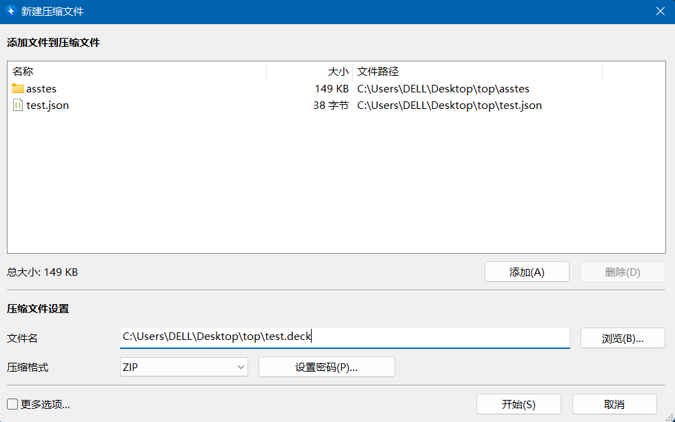
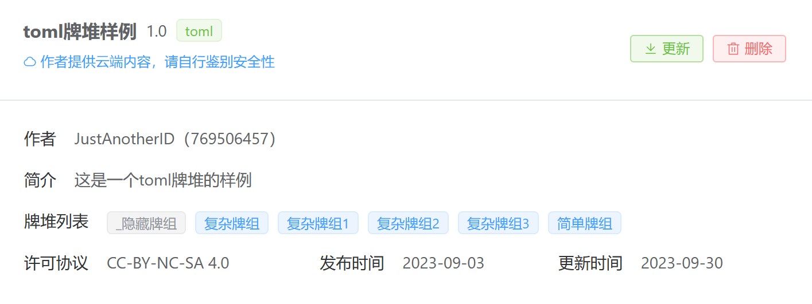

# 编写牌堆

::: info 本节内容

本节将介绍牌堆的编写，请善用侧边栏和搜索，按需阅读文档。

:::

## 概览

海豹核心目前支持 `toml`、`json` 和 `yaml` 格式的牌堆。

如果对其中某种格式的语法有了解，建议选择熟悉的格式。如果都不了解，建议选择使用适用性最广的 `json` 格式。

当然，如果你的海豹版本较新，我们也非常推荐你尝试 `toml` 格式的牌堆编写。`toml` 格式诞生较晚，语法支持更多现代特性，海豹为这种格式的牌堆支持了更多功能。

::: warning 注意：牌堆文件的编码

**永远** 使用「UTF-8 编码」来编写牌堆。

:::

## 语法快速入门

我们将简单介绍 `toml` `json` `yaml` 的语法，仅说明牌堆编写中会用到的部分，帮助你快速了解它们。

::: tip 提示：深入学习

我们也非常建议你系统地学习它们，可以参见这些文档或自行搜索：

- [TOML 文档](https://toml.io/cn/v1.0.0)、[TOML 教程](https://zhuanlan.zhihu.com/p/348057345)
- [菜鸟教程 - JSON](https://www.runoob.com/json/json-tutorial.html)
- [YAML 语言教程](https://www.ruanyifeng.com/blog/2016/07/yaml.html)

:::

::: warning 注意：务必注意使用半角符号！

下面的语法中涉及到的符号都是 **半角符号**，如果你出现了奇怪的问题，记得检查是否在输入法的中文输入状态，导致输入了错误的符号。

比如应该为 `,` 却使用了 `，`，应该为 `""` 却使用了 `“”`。

使用专业的编辑器能帮助你检查这些问题。

:::

:::: tabs key:deck-format

== toml

### TOML 注释

注释以 `#` 开头，用来记录相关说明性内容。

```toml
# 这是注释

key = "value" # 注释也可以放在行尾
```

### TOML 键值对

「键值对」是 TOML 文档最基本的元素。

```toml
key = "value"
```

键名在等号的左边而值在右边，键、等号和值必须在同一行（有些值可以跨多行），不允许没有值。

值需要是下述类型之一：

- 字符串：以 `""` `''` 或 `""" """` 包裹起来的一串文字
- 整数、浮点数（即小数）
- 布尔值：`true` 和 `false`
- 日期或时刻：采用 RFC 3339 格式，如 `1919-08-10` `1919-08-10 11:45:14`
- 数组：`[]` 包裹的一系列值
- 内联表：表的一种紧凑表示法，`{}` 包裹的一系列键值对

键值对后必须换行（或结束文件）。

### TOML 键名

键名可以是裸键名，也可以是用 `""` 引起来的字符串，都将被看作是字符串（哪怕裸键是 `1234` 也是这样）。

- 裸键只能包含 ASCII 字母，ASCII 数字，下划线和短横线（即只有 `A-Za-z0-9_-`）。
- 引号键则允许包含任何 Unicode 字符（如中文），支持转义；

::: warning 注意：裸键名不支持中文

使用中文作为键名时，必须用引号包裹。

:::

### TOML 字符串

使用 `""` 或者 `''` 包裹的内容作为字符串。任何 Unicode 字符都可以使用，支持转义（如换行 `\n`、反斜杠 `\\`）。

如果字符串有很多行，可以使用多行字符串语法：

```toml
key = """
这是多行字符串的语法，它支持你直接使用换行。
不用再拼接 \n 来换行了，好耶！
但是这样写在最前面会多出换行，因为第一行的空换行也直接读取了。
"""

key2 = """\
这样写就没有开头的空行问题了。
"""
```

多行换行符中，如果一行的最后一个非空白字符是未被转义的 `\` 时，它会连同它后面的所有空白（包括换行）一起被去除，直到下一个非空白字符或结束引号为止。

### TOML 表

表（哈希表、字典、对象，含义相同）是键值对的集合。「表头」为一个单独的 `[]` 包裹的行作为表名，后面的行都是该表的内容。

```toml
["海豹核心"]
"简介" = "一个简单易用的跑团骰子系统"
"状态" = "持续开发中"

["狐狸核心"]
"简介" = "一个更加简单易用的跑团骰子系统（什"
"状态" = "根本不存在"
```

以上结构相当于 JSON 中的：

```json
{
  "海豹核心": {
    "简介": "一个简单易用的跑团骰子系统",
    "状态": "持续开发中"
  },
  "狐狸核心": {
    "简介": "一个更加简单易用的跑团骰子系统（什",
    "状态": "根本不存在"
  }
}
```

表还有一种更紧凑的内联表示法，必须在同一行内，且不支持尾逗号：

```toml
"海豹核心" = { "简介" = "一个简单易用的跑团骰子系统", "状态" = "持续开发中" }
```

### TOML 数组

数组是用 `[]` 包裹的一系列值，子元素由 `,` 分隔。

```toml
TRPG = [
  { name = "CoC", version = "7" },
  { name = "D&D", version = "5e" }, # 多出一个逗号也是可以的
]
```

== json

::: info JSON with Comment / JWCC <Badge type="tip" text="v1.4.4"/>

从 <Badge type="tip" text="v1.4.4"/> 起，海豹支持在牌堆中使用 [JSON With Commas and Comments](https://nigeltao.github.io/blog/2021/json-with-commas-comments.html) 。

这是一种对标准 JSON 语法的扩展，允许在文件中使用 C/C++ 风格的注释，并允许 JSON 对象和数组的最后一个键值对和元素后带有逗号。

我们认为这种扩展有益于减少编写者的负担，又不会引入过多的非标准特性造成混乱。

从 <Badge type="tip" text="v1.4.5"/> 开始，海豹支持读取以 `.jsonc` 为扩展名的牌堆文件。我们推荐采用这种方式，将使用扩展语法的牌堆与标准 JSON 牌堆区分开，以示它们的不同，但是否这样做取决于你的选择。

:::

::: warning

如果你使用 <Badge type="warning" text="v1.4.3"/> 或更早版本的海豹核心，你仍必须使用 标准 JSON 牌堆。

:::

### JSON 键值

JSON 键值对以 `"key": value` 的形式表达，需要包裹在 `{}` 或 `[]` 中。

```json
{
  "key": "value"
}
```

其中键名必须用 `""` 包裹，值可以是如下类型：

- 整数、浮点数（即小数）
- 字符串（由 `""` 包裹，不可以是 `''`）
- 布尔值（`true` 或 `false`）
- 数组：由 `[]` 包裹的一组值
- 对象：由 `{}` 包裹的一组键值对
- `null`：空

### JSON 数组

由 `[]` 包裹的一组值，使用 `,` 分割。

```json
[
  "CoC",
  "D&D"
]
```

从 <Badge type="tip" text="v1.4.4"/> 版本开始支持尾逗号，即在数组尾部有多余逗号时不再报错。

```json
[
  "CoC",
  "D&D", // 此处可以多出一个逗号
]
```

### JSON 对象

由 `{}` 包裹的一组键值对，使用 `,` 分割。

```json
{
  "海豹核心": {
    "简介": "一个简单易用的跑团骰子系统",
    "状态": "持续开发中"
  },
  "狐狸核心": {
    "简介": "一个更加简单易用的跑团骰子系统（什",
    "状态": "根本不存在"
  }
}
```

从 <Badge type="tip" text="v1.4.4"/> 版本开始支持尾逗号，即在对象尾部有多余逗号时不再报错。

```json
{
  "海豹核心": {
    "简介": "一个简单易用的跑团骰子系统",
    "状态": "持续开发中", // 此处可以多出一个逗号
  },
  "狐狸核心": {
    "简介": "一个更加简单易用的跑团骰子系统（什",
    "状态": "根本不存在", // 此处可以多出一个逗号
  }, // 此处可以多出一个逗号
}
```

### 注释 <Badge type="tip" text="v1.4.4"/>

从 <Badge type="tip" text="v1.4.4"/> 开始支持 C/C++ 风格的注释。以下为简要说明。

#### 1. 行内注释

以两个斜杠（`//`）开头，直到该行结束的所有文本都被视为注释。

#### 2. 注释块

从序列 `/*` 开始到随后出现的第一个 `*/` 序列为止的所有文本，包括换行，都被视为注释。

== yaml

### YAML 注释

注释以 `#` 开头。

### YAML 键值

YAML 键值对使用冒号结构表示 `key: value`，冒号后面要加一个空格。

值可以是如下类型：

- 字符串：
  - 直接表示：`这是一段字符串`
  - 可以使用 `""` 或者 `''`包裹，双引号不会对特殊字符转义：`'Hello world'`
- 布尔值：`true` `false`
- 整数、浮点数（即小数）
- Null：用 `~` 表示
- 时间、日期：采用 ISO8601 格式

### YAML 对象

可以使用行内语法表示对象：

```yaml
海豹核心: { 简介: 一个简单易用的跑团骰子系统, 状态: 持续开发中 }
狐狸核心: { 简介: 一个更加简单易用的跑团骰子系统（什, 状态: 根本不存在 }
```

也可以使用缩进层级表示对象关系（推荐）：

```yaml
海豹核心:
  简介: 一个简单易用的跑团骰子系统
  状态: 持续开发中
狐狸核心:
  简介: 一个更加简单易用的跑团骰子系统（什
  状态: 根本不存在
```

::: warning 注意：缩进是有含义的

在 YAML 中，缩进是有含义的，缩进的长度表示了层级。

缩进不允许 tab，只允许使用空格。缩进的空格数并不重要，但**相同层级的元素必须左对齐**。

当你在复制粘贴 YAML 文本时，请务必注意这一点，格式错乱会无法识别。

:::

### YAML 数组

YAML 可以使用行内语法表示数组：

```yaml
[ A, B, C ]
```

也可以使用以 `-` 开头的行表示构成一个数组：

```yaml
- A
- B
- C
```

数据结构的子成员是一个数组，则可以在该项下面缩进一个空格：

```yaml
TRPG:
  - name: CoC
    version: '7'
  - name: D&D
    version: 5e
```

::: tip 提示：复杂的 YAML

YAML 的语法极其灵活，同一种形式在 YAML 中可以有多种等价表示方法，这里只列出了常见的。

如果你在阅读其它人的 YAML 牌堆时遇上了看不懂的内容，建议通过更系统的教程学习。

:::

::::

## 基础牌堆编写

海豹的抽取指令为 `.draw <key>`，而牌堆就是可以提供一些 key 作为牌组的文件。

我们从编写一个最简单的牌堆开始，我们希望：

1. 这个牌堆有 `快端上来罢` 和 `数字论证` 两个牌组；
   - `.draw 快端上来罢` 可以抽取出 `哼哼哼啊啊啊啊啊` `你是一个一个一个牌堆结果` 这两个结果；
   - `.draw 数字论证` 可以抽取出 `114514` `1919810` 这两个结果。
2. 填写一些信息（如作者），便于分享。

这个牌堆编写如下，你可以选择以下任意一种格式来学习：

::: tabs key:deck-format

== toml

```toml
# 元信息表
[meta]
title = "野兽牌堆"
author = "田所浩二"
# 有多个作者时可以使用，两者仅需保留一行
authors = ["田所浩二"]
version = "1.0"
license = "CC-BY-NC-SA 4.0"
date = 1919-08-10
update_date = 1919-08-10
desc = "这个示例牌堆怎么这么臭（恼）"

# 牌组表
[decks]
"快端上来罢" = [
  "哼哼哼啊啊啊啊啊",
  "你是一个一个一个牌堆结果"
]
"数字论证" = [
  "114514",
  "1919810"
]
```

一个 TOML 牌堆的最基本格式如上。其中 `meta` 表中的信息不是必须的，但我们非常建议你保留并填写这些项，它们能在分享时说明更多信息：

- `title`：牌堆的标题；
- `author`/`authors`：牌堆作者；
- `date`：牌堆创建日期；
- `updateDate`：牌堆更新日期；
- `desc`：牌堆简介；
- `version`：牌堆版本；
- `license`：牌堆协议。

可以将上述内容保存名为 `野兽牌堆.toml`（名称任意，但必须是以 `.toml` 为后缀扩展名）的文件进行测试。

== json

```json
{
  "_title": [ "野兽牌堆" ],
  "_author": [ "田所浩二" ],
  "_date": [ "1919-08-10" ],
  "_updateDate": [ "1919-08-10" ],
  "_brief": [ "这个示例牌堆怎么这么臭（恼）" ],
  "_version": [ "1.0" ],
  "_license": [ "CC-BY-NC-SA 4.0" ],
  "快端上来罢": [
    "哼哼哼啊啊啊啊啊",
    "你是一个一个一个牌堆结果"
  ],
  "数字论证": [
    "114514",
    "1919810"
  ]
}
```

一个 JSON 牌堆的最基本格式如上。其中以 `_` 开头的项不是必须的，但是我们非常建议你保留并填写这些项，它们能在分享时说明更多信息：

- `_title`：牌堆的标题；
- `_author`：牌堆作者；
- `_date`：牌堆创建日期；
- `_updateDate`：牌堆更新日期；
- `_brief`：牌堆简介；
- `_version`：牌堆版本；
- `_license`：牌堆协议。

可以将上述内容保存名为 `野兽牌堆.json`（名称任意，但必须是以 `.json` 为后缀扩展名）的文件进行测试。

== yaml

```yaml
name: 野兽牌堆
author: 田所浩二
version: 1
license: CC-BY-NC-SA 4.0
desc: 这个示例牌堆怎么这么臭（恼）
command:

快端上来罢:
  - 哼哼哼啊啊啊啊啊
  - 你是一个一个一个牌堆结果
数字论证:
  - '114514'
  - '1919810'
```

一个 YAML 牌堆的最基本格式如上。其中上半部分的一些项不是必须的，但是我们非常建议你保留并填写这些项，它们能在分享时说明更多信息：

- `name`：牌堆的标题；
- `author`：牌堆作者；
- `version`：牌堆版本，应是一个整数；
- `license`：牌堆协议；
- `desc`：牌堆简介。

可以将上述内容保存名为 `野兽牌堆.yaml`（名称任意，但必须是以 `.yaml` 或 `.yml` 为后缀扩展名）的文件进行测试。

:::

::: warning 注意：牌堆文件扩展名正确吗？

保存文件时务必确认开启了操作系统的扩展名显示，避免出现看上去保存了 `xxx.json` 文件，但实际上的文件名是 `xxx.json.txt`。

:::

## 牌堆语法

### 一个项中抽取其他项

牌堆抽取结果字符串中，可以实现抽取其他项，将内容拼接进该结果。

- `{key}` 表示不放回抽取；
- `{%key}` 表示放回抽取。

:::: tabs key:deck-format

== toml

```toml
[decks]
"时间点" = [
  "早上",
  "中午",
  "晚上",
]
"追尾了" = [
  "在{%时间点}追尾了一辆高级黑色轿车",
]
```

== json

```json
{
  "时间点": [
    "早上",
    "中午",
    "晚上"
  ],
  "追尾了": [
    "在{%时间点}追尾了一辆高级黑色轿车"
  ]
}
```

== yaml

::: warning 注意：YAML 的放回表示

YAML 牌堆中的表示正好相反：

- `{key}` 表示放回抽取；
- `{%key}` 表示不放回抽取。

:::

```yaml
时间点:
  - 早上
  - 中午
  - 晚上
追尾了:
  - 在{时间点}追尾了一辆高级黑色轿车
```

::::

#### 放回抽取与不放回抽取

放回抽取，指此次抽取后抽取的牌组保持原样，每次都相当于从全新牌组中抽取，你仍可能抽到相同结果。

不放回抽取，尺度是**一次抽牌指令**，在这一次指令的执行过程中不会再从该牌组中抽到相同结果。多次抽取指令 `draw 3# 牌组` 只被视为一次指令，不放回抽取生效。指令执行结束后，将重置所有牌组到初始状态。

需要提到，带有权重调整的项目**不会**被视为在牌组中有多个副本。在[下文](#权重)中有详细讨论。

示例：不放回抽取

```toml
[decks]
"拷打木落" = [
  "泡面偷走叉子调料包",
  "捏碎所有薯片",
  "用勺子把西瓜最中间的一块全挖走",
]
"拷打木落三次" = [ "{%拷打木落} {%拷打木落} {%拷打木落}" ]
"不同方式拷打木落三次" = [ "{拷打木落} {拷打木落} {拷打木落}" ]
```

在此示例中，牌组「拷打木落三次」的项目采用了放回抽取，「不同方式拷打木落三次」采用了不放回抽取。

如果抽取 `draw 拷打木落三次`，得到的三个结果可能有重复。

如果抽取 `draw 不同方式拷打木落三次`，得到的三个结果将互不相同，但顺序是随机的。通过 `draw 3# 拷打木落` 也可达成类似的效果。

### 插入掷骰表达式

抽取结果字符串中的 `[exp]`，会先执行其中的掷骰表达式 `exp`，再组合到原字符串里。

如：抽取 `企鹅早该爆金币辣！v我[1d10]个金币` 的结果可能是 `企鹅早该爆金币辣！v我1个金币`。

::: details 补充：旧的实现

研究旧牌堆，可能会发现有牌堆通过下面这样的写法来实现这个功能，**现在请不要这么做了**。

```json
{
  "数字": [1, 2, 3, 4, 5, 6, 7, 8, 9, 10],
  "爆金币": "企鹅早该爆金币辣！v我{%数字}个金币"
}
```

:::

### 权重

抽取结果字符串中最前面的 `::value::` 表示该项的权重。不含有该标记的项目被视为拥有默认权重 1。


示例：有 1/10 的几率出现闪光海豹

::: tabs key:deck-format

== toml

```toml
[decks]
"捕捉海豹" = [
  "::9::海豹",
  "✨闪光海豹✨"
]
```

== json

```json
{
  "捕捉海豹": [
    "::9::海豹",
    "✨闪光海豹✨"
  ]
}
```

== yaml

```yaml
捕捉海豹:
  - ::9::海豹
  - ✨闪光海豹✨
```

:::

#### 权重与不放回抽取

在使用不放回抽取的情况下，标记权重的项目**不会**被视为单个项目的多个副本。以上文的例子而言，牌组中仍被视为只有 2 个项目。

如果使用 `draw 捕捉海豹 2#` 进行抽取，**一定**会获得 1 个「海豹」和 1 个「✨闪光海豹✨」。

在这种情况下，权重影响的是抽出的顺序。你将以 9/10 的概率先抽出「海豹」，以 1/10 的概率先抽出「✨闪光海豹✨」。

::: details 补充：旧的实现

研究旧牌堆，可能会发现有牌堆通过下面这样的写法来实现这个功能，**现在请不要这么做了**。

```json
{
  "捕捉海豹": [
    "海豹", "海豹", "海豹", "海豹", "海豹", "海豹", "海豹", "海豹", "海豹",
    "✨闪光海豹✨"
  ]
}
```

:::

### 发送图片等

抽取结果字符串中可以插入 CQ 码和海豹码，比如 `[图:data/images/sealdice.png]`。

#### 牌堆打包

发布带图牌堆最常见的选择是牌堆文件连同图片打包成一个压缩包，但是这样做有诸多不便之处。

如果你不想发布时在压缩包里添加一个教程，告诉你的用户如何解压、图片要放到那个文件夹下、什么是相对路径……那就把牌堆打包成可以在海豹 UI 直接上传的 `*.deck` 文件吧。

::: info

`deck` 文件在本质上依然是 `zip` 文件，修改后缀只是便于海豹识别。

:::

假如牌堆文件内容如下（使用相对路径 `./asstes/...` ）：

```json
{
  "test":["[图:./asstes/1.jpg]"]
}
```

则牌堆文件所在文件夹结构应是：

```text
.
├─asstes
│  └─1.jpg
└─ test.json
```

选中牌堆文件和 assets 文件夹压缩为 ZIP 文件，修改文件后缀为 deck 。



图例中所使用的软件为 Bandizip ，使用 Windows 右键菜单中的 `压缩为 ZIP 文件` 与之等价的。

::: warning 注意：小心嵌套文件夹

以示例图中路径为例，不要回退到上一级目录然后选中 top 文件夹压缩。

:::

### 牌组的隐藏和导出控制

`.draw keys` 指令会列出所有允许抽取的牌组，但在牌堆编写过程中，经常会需要用到辅助的牌组，这些辅助项是不希望暴露给用户的。我们可以通过一定方式来隐藏这些项。

::: tabs key:deck-format
== toml

在 TOML 牌堆中，当牌组的名称以 `_` 开头，那么这个牌组将不会暴露在 `.draw keys` 中。

```toml
[decks]
"_时间点" = [
  "早上",
  "中午",
  "晚上",
]
"追尾了" = [
  "在{%_时间点}追尾了一辆高级黑色轿车",
]
```

这样在 `.draw keys` 中就不会展示 `_时间点` 这一牌组。

== json

在 JSON 牌堆中，可以通过配置牌堆文件的 `_keys` 指定所有显示的牌组，未指定在列表中的牌组将不会暴露在 `.draw keys` 中。

```json
{
  "_keys": [ "追尾了" ],
  "时间点": [
    "早上",
    "中午",
    "晚上"
  ],
  "追尾了": [
    "在{%时间点}追尾了一辆高级黑色轿车"
  ]
}
```

这样在 `.draw keys` 中就不会展示 `时间点` 这一牌组。

== yaml

YAML 牌堆**没有支持**这一功能。

:::

被隐藏的项不会在 `.draw keys` 中展示，但依然可以通过指定 `.draw <key>` 的方法抽取。如果你希望某些牌组彻底隐藏，只能在牌堆内部调用，可以通过配置它们的导出来实现：

::: tabs key:deck-format

== toml

在 TOML 牌堆中，当牌组的名称以 `__`（双下划线）开头，那么这个牌组将不导出，即无法使用 `.draw <key>` 进行抽取，更不会显示在列表中。

```toml
[decks]
"__时间点" = [
  "早上",
  "中午",
  "晚上",
]
"追尾了" = [
  "在{%__时间点}追尾了一辆高级黑色轿车",
]
```

== json

在 JSON 牌堆中，当牌组的名称以 `_` 开头，那么这个牌组将不导出，即无法使用 `.draw <key>` 进行抽取，更不会显示在列表中。

```json
{
  "_时间点": [
    "早上",
    "中午",
    "晚上"
  ],
  "追尾了": [
    "在{%_时间点}追尾了一辆高级黑色轿车"
  ]
}
```

这样 `_时间点` 这一牌组无法再用 `.draw _时间点` 抽取了。

此外，通过配置牌堆文件的 `_export`/ `_exports` 可以指定所有的导出项。未指定在列表中的牌组将无法使用 `.draw <key>` 进行抽取，更不会显示在列表中。

```json
{
  "_exports": [ "追尾了" ],
  "时间点": [
    "早上",
    "中午",
    "晚上"
  ],
  "追尾了": [
    "在{%时间点}追尾了一辆高级黑色轿车"
  ]
}
```

== yaml

如果在 YAML 牌堆中定义了 `default` 字段，海豹将以 `command` 字段的值为关键字，`default` 字段的值为内容组成一个牌组。除了这个牌组以外的牌组都被视为不导出。

```yaml
command: 追尾了
default:
  - "在{时间点}追尾了一辆高级黑色轿车"

时间点:
  - 早上
  - 中午
  - 晚上
```

在以上例子中，`.draw keys` 将只列出 `追尾了`；`.draw 时间点` 将提示找不到牌组。

:::

::: tip 提示：UI 中识别隐藏的牌组

你可以通过查看牌堆管理界面中的「牌堆列表」来识别牌组是否隐藏。



灰色的牌组是隐藏的，即不展示在列表中，但能够被 `.draw <key>` 抽取。

未导出（不展示也不能抽取）的牌组不展示在该列表中。

:::

### 配置牌堆更新

很多时候，牌堆内容不是一成不变的。而使用牌堆的用户需要手动去获取最新的牌堆，才能获得作者们提供的最新内容。

我们为牌堆提供了配置更新链接的机制，方便骰主快速获取牌堆更新。有能力的牌堆作者可以配置更新链接，便于分享最新的牌堆内容。

::: tabs key:deck-format

== toml

配置牌堆文件的 `updateUrls` 以指定对应的更新链接：

```toml
[meta]
title = "野兽牌堆"
updateUrls = [
  "https://updateurl.com" # 此处填写你的更新链接
]

# 牌组表
[decks]
"快端上来罢" = [
  "哼哼哼啊啊啊啊啊",
  "你是一个一个一个牌堆结果"
]
"数字论证" = [
  "114514",
  "1919810"
]
```

== json

配置牌堆文件的 `_updateUrls` 以指定对应的更新链接：

```json
{
  "_title": [ "野兽牌堆" ],
  "_updateUrls": [ "https://updateurl.com" ],
  "快端上来罢": [
    "哼哼哼啊啊啊啊啊",
    "你是一个一个一个牌堆结果"
  ],
  "数字论证": [
    "114514",
    "1919810"
  ]
}
```

== yaml

配置牌堆文件的 `update_urls` 以指定对应的更新链接：

```yaml
name: 野兽牌堆
update_urls:
  - 'https://updateurl.com'

快端上来罢:
  - 哼哼哼啊啊啊啊啊
  - 你是一个一个一个牌堆结果
数字论证:
  - '114514'
  - '1919810'
```

:::

有多个更新链接时，海豹将依次从上往下检查更新。

### 插入海豹内置脚本语言

抽取结果字符串中可以插入 [海豹语](../advanced/script.md) 。

::: tip 提示：特殊的括号

与在文案和自定义回复中插入海豹语使用 `{}` 不同，在牌堆中 `{}` 有其他含义，需要用 `[]` 代替 `{}` 。

:::

::: tabs key:deck-format

== toml

```toml
[decks]
"幸运转盘" = [
  "你抽到了114金币，你现在有[$m金币=$m金币+114]",
  "你失去了514金币，你现在有[$m金币=$m金币-514]"
]
```

== json

```json
{
  "幸运转盘": [
  "你抽到了114金币，你现在有[$m金币=$m金币+114]",
  "你失去了514金币，你现在有[$m金币=$m金币-514]"
  ]
}
```

== yaml

```yaml
幸运转盘:
  - 你抽到了114金币，你现在有[$m金币=$m金币+114]
  - 你失去了514金币，你现在有[$m金币=$m金币-514]
```

:::

## TOML 牌堆的更多功能

### 更多牌组设置

TOML 牌堆中，你可以以表的形式来创建更复杂的牌组，这允许你更精细的控制每个牌组的选项。

复杂牌组和普通牌组在使用上没有什么区别，仅仅是提供了配置选项的能力。

```toml
[meta]
title = "野兽牌堆"
updateUrls = [
  "https://updateurl.com" # 此处填写你的更新链接
]

# 简单牌组表
[decks]
"快端上来罢" = [
  "哼哼哼啊啊啊啊啊",
  "你是一个一个一个牌堆结果"
]

# 复杂牌组
["数字论证"]
export = true
visible = true
aliases = [ "恶臭论证" ]
options = [
  "114514",
  "1919810",
]
```

表名将作为这个牌组的名称，复杂牌组提供以下选项：

- `export`：是否导出该牌组；
- `visible`：该牌组是否可见，不可见的将不展示在 `.draw keys` 列表中；
- `aliases`：牌组的别名，可以使用别名抽取改牌组，如上述示例中可以使用 `.draw 数字论证` 或 `.draw 恶臭论证` 来抽取；
- `options`：该牌组的项。

::: warning 注意：设置的选项未生效？

注意，对应的选项名需要完全一致，否则海豹将无法正确解析。

如 `aliases` 不要误写成 `alias`，`options` 不要误写成 `option`。

:::

### 云端内容

某些情况下，我们希望牌堆内容能够自动更新，骰主无需反复更新骰子中装载的牌堆，用户也能抽取到最新内容。例如，一个实时更新的公骰列表牌堆。

海豹支持为牌堆提供云端内容，这需要牌堆作者有能力提供一个 API 接口，**每次** 配置了接口的牌组被抽取的时候，都会调用该接口获取该牌组的最新数据。

::: warning 注意：不受控的云端内容

海豹核心无法核查从接口处获取的数据，骰主需要自行确认数据源不会返回你不希望骰子发出的信息。

对于提供了云端内容的牌堆，在海豹 Web UI 的牌端管理界面，会强制增加相应标识，以显示该牌堆提供了云端内容。

:::

#### API 接口要求

海豹将以 HTTP GET 的方式请求对应接口，接口应当返回一个 JSON 字符串数组数据，其每个元素均是牌组的一个条目。

返回结果示例如下：

```json
[
  "3 = 11*-4+51-4",
  "114 = 11*4+5*14",
  "514 = (1-1)/4+514"
]
```

#### 牌堆配置云端内容

目前仅有 TOML 牌堆支持云端内容，示例如下：

```toml
[meta]
title = "野兽牌堆-云端内容示例"

["114514种论证"]
export = true
visible = true
options = [
  "1 = 11/(45-1)*4",
  "2 = -11+4-5+14",
  "3 = 11*-4+51-4"
]
# 开启云内容
cloud_extra = true
# 云内容与本地内容去重
dictinct = true
# 云内容链接
options_urls = [
  "此处替换为对应的 API 链接，类似 http://example.com/xxx",
]
```

*假定上面填入了 API，它会返回上一节中的示例 JSON 字符串数组，即 `["3 = 11*-4+51-4", "114 = 11*4+5*14", "514 = (1-1)/4+514"]`。*

正如上面示例中看到的那样，在 TOML 格式的复杂牌组中，有一些云端内容的相关配置项，每个牌组都可以单独控制云端相关设置。抽取牌组时，接口返回的数据将和牌组本身配置的 `options` 数组合并，最后的抽取是从合并的数组中进行。

- `cloud_extra`：为 `true` 时，抽取本牌组时将请求接口获取云端数据；
- `options_urls`：配置云端内容的 API 链接，链接能够配置多个。**每次抽取这个牌组时，会依次调用配置的 API，在任意一个接口成功返回数据后即停止**；
- `distinct`：为 `true` 时，云端数据与本地数据合并后会进行去重，确保最终抽取的牌组中不含重复条目。

以上述牌组为例，当执行 `.draw 114514种论证` 的时候，将首先调用 API 获取云端内容，成功获取后进行合并并去重，最终抽取的牌组相当于直接配置了这样的牌组：

```toml
["114514种论证"]
export = true
visible = true
options = [
  "1 = 11/(45-1)*4",
  "2 = -11+4-5+14",
  "3 = 11*-4+51-4",
  "114 = 11*4+5*14",
  "514 = (1-1)/4+514"
]
```
