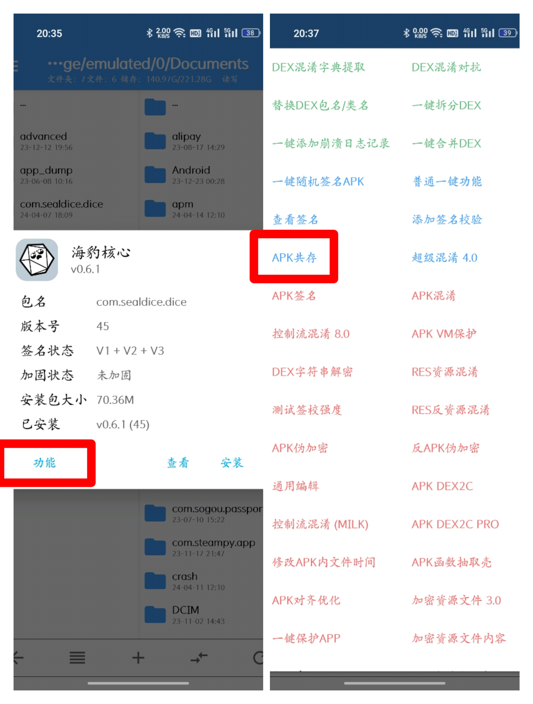
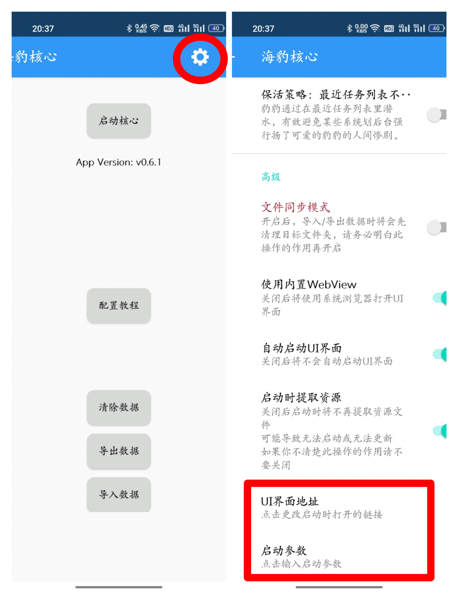

# 安卓端海豹相关

::: info 本节内容

本节将介绍安卓端海豹核心常见问题和解决方法。

:::

## 海豹文件路径

海豹文件无法直接被读取，需要先停止核心，点击**导出数据**按钮，数据导出路径为`/storage/emulated/0/Documents/com.sealdice.dice/sealdice/`

修改完文件后需要点击**导入数据**按钮才可被海豹核心读取。

::: warning

在手机海豹上，每次导入数据前都进行一次导出，导出后不要再运行海豹核心。

这是因为，手机海豹**不会**实时更新导出的文件，它们是海豹数据在导出时的一份快照。

如果在上次导出后产生了新数据，而再次进行导入，会导致新产生的数据被之前导出的数据覆盖，丢失这段时间以来录入的角色卡、Log、修改的自定义文案等海豹内部的数据。

:::

## 登录相关

### 只有一个设备，但登录需要扫码

使用TIM可以从相册扫码。

### 经常掉线

查看[配置安卓端保活](https://docs.sealdice.com/deploy/android_keepalive.html)对应系统修改系统设置，确保海豹核心能够在后台存活。

### 双开手机版

方法一：使用**应用分身**双开海豹核心。

方法二：下载**np管理器**修改海豹核心安装包。

:::: info 方法二

1.下载[np管理器](https://github.com/githubXiaowangzi/NP-Manager)并安装。

2.打开 np 管理器，找到手机豹安装包。

3.选择功能-APK 共存。

4.安装改过的安装包，打开海豹核心。

5.选择右上角小齿轮，修改 UI 界面地址和启动参数，将里面的 3211 改成 3212。

6.启动核心。

::::

## 发送图片

引用图片正确格式示例:`[图:data/iamges/1.jpg]`，涉及到的符号均是英文符号，不要使用`\`。

:::: info 添加图片的方法

·利用导入导出功能将图片放入海豹的导出文件夹,然后导入。

·使用MT管理的的"APK一键注入文件提供器功能"配合“添加本地储存"这两个功能访问海豹的私有目录。

:::: 

## 如何更新

手机版可以`指令/UI`更新，若无法更新，下载最新安装包覆盖即可。

手机版尚在公测，以防万一最好导出一次保留数据。

## 电脑海豹转手机海豹

查看[迁移数据到手机](https://docs.sealdice.com/deploy/transfer.html#%E8%BF%81%E7%A7%BB%E6%95%B0%E6%8D%AE%E5%88%B0%E6%89%8B%E6%9C%BA)，手机转电脑同理。