# 其他数据库的连接

::: info 本节内容

本节将介绍用户如何使用海豹连接 MySQL 数据库，此教程亦适用于 MariaDB 数据库。

:::

::: warning 注意：

我们认为，大部分情况下，优化过的 SQLite 数据库已足够用户使用，需要更换数据库的用户应该认为目前海豹的 SQLite 数据库无法满足他的需求。

所以，我们默认观看本节的用户对数据库有一定了解，并存在一定的计算机编程知识或计算机使用知识。

如你不具备相应知识，那么本节可能无法给你有用的帮助。

:::

::: danger 警告：

MySQL 尚未经过大批量数据测试。由于 MySQL 的联合索引长度问题，MySQL 的联合索引均未创建，这可能会导致性能下降！

另外，创建数据库需要用户自行注意数据库连接安全，请务必设置较强密码以防止数据丢失！

:::

## 海豹支持的数据库系统

从 <Badge type="tip" text="v1.5.0"/> 起，除原有的 `SQLite` 数据库外，海豹新支持了 `MySQL`、`PostgresSQL（ PGSQL ）`的连接。

你可以通过修改 `.env` 文件以切换至海豹支持的其他数据库。

下面，我们详细对 MySQL 数据库与 PostgresSQL（PGSQL）数据库同海豹的对接进行讲解。

## 对接 MySQL

### 准备工作

#### 安装 MySQL

请跟随下方的安装方式，安装对应你所使用的平台的 MySQL/MariaDB:

<https://www.runoob.com/mysql/mysql-install.html>

安装时，其要求你输入密码，记下该密码，并供使用。

#### 选择合适的 DB 工具

由于大部分用户并不擅长非图形化页面的操作，此处提供一个可视化工具供使用，本教程选用 `squirrelsql` 作为可视化工具。

本教程主要服务于 Windows Server 用户，其他用户可自行按照原理使用 SQL 命令来创建等效的数据库。

在 这里 下载定制好的 `squirrelsql`。该 `squirrelsql` 设置为开箱即用，允许修改 SQLite/MySQL/PostgreSQL 三种类型的数据库。请将 `squirrelsql` 放置在和 MySQL 相同的服务器上。

#### 创建数据库

我们需要为我们的海豹创建一个单独的数据库，这里的概念比较抽象：

一个 MySQL 数据库 可以创建多个 "DataBase（数据库）"

在后文中，提及数据库的若无 MySQL 前缀，均认为是 "database" 数据库。

一个数据库对应一个海豹实例，也就是说一个 MySQL 数据库可以支持多个数据库，进而支持多个海豹的实例。

详细细节可以参考如下链接:
<https://www.runoob.com/mysql/mysql-create-database.html>

此处以创建 "seal" 数据库为例，进行数据库的创建。首先启动 Squirrel SQL，页面如图所示：

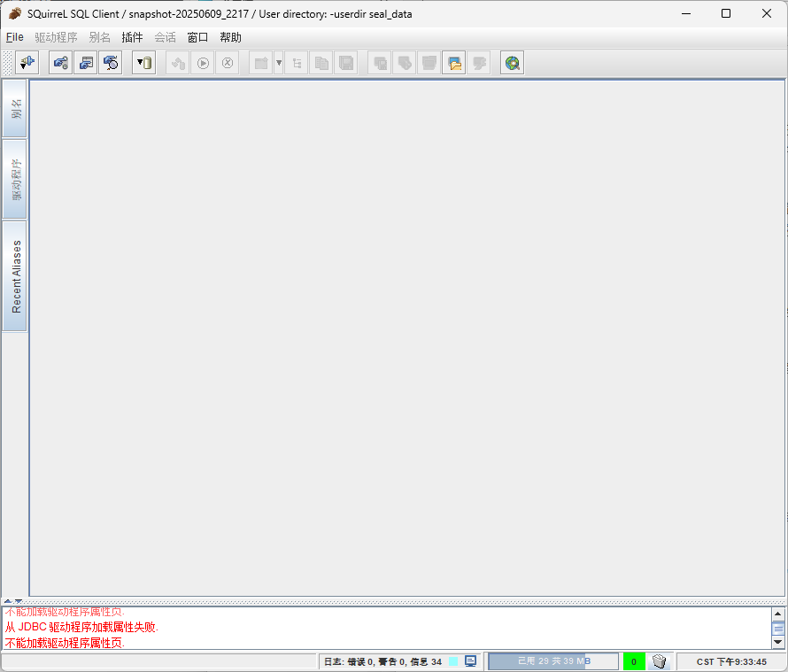

单击左侧的别名，而后点击加号：

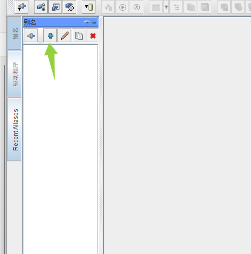

驱动程序选择 MySQL Driver，名称填写任意名称。此处选择填写“SealDice-01”。地址按如下填写

``` CONFIG
jdbc:mysql://127.0.0.1:3306/?charset=utf8mb4&parseTime=True&loc=Local
```

用户名和密码填写在 安装 MySQL 时输入的用户名和密码。而后点击连接，连接后的页面如图所示：

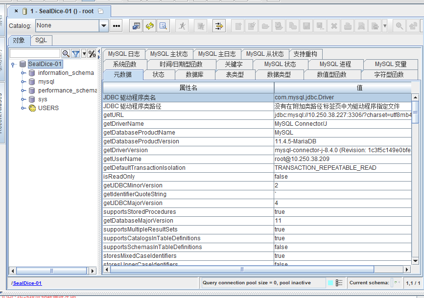

我们要创建一个数据库，在左侧树状部分随意右键 - 创建数据库：

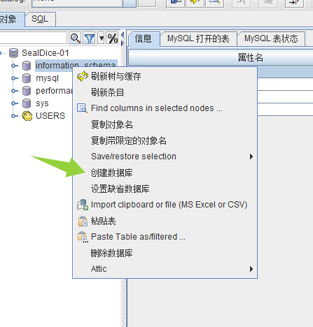

输入名称：seal 后点击确定：

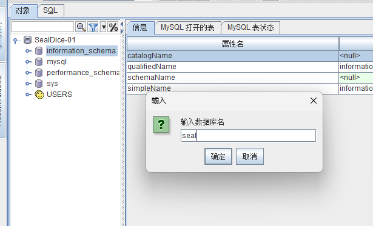

之后我们将看到新的数据库被创建出来：

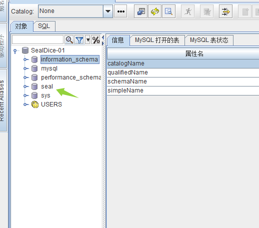

### 创建 MySQL 用户（非必选）

你可以使用 root 用户直接连接 MySQL，但这是不推荐的，尤其是在你要多个骰子共用同一个数据库的情况。更多情况下，我们会创建一个额外的新用户，以保证数据库安全。

我们采用创建 "sealdice" 用户，密码为 "Sealdice123!" 的方式来进行教学。SQuirrel SQL 不支持直接 GUI 创建用户，我们需要使用 SQL 面板来创建一个新用户。

单击 SQL 面板，切换到 SQL 模式：

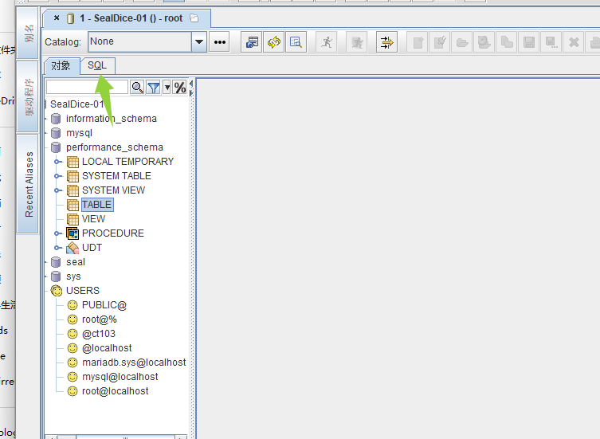

切换到 SQL 模式后，可以稍微拖拉拽一下，让这个 SQL 面板变大：

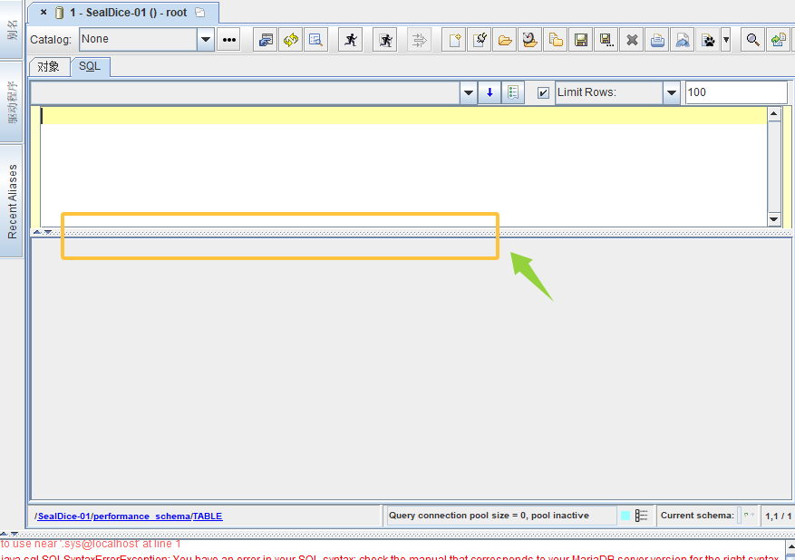

在此处输入如下内容：

```SQL
CREATE USER 'sealdice'@'localhost' IDENTIFIED BY 'Sealdice123!';
```

注意，不可省略分号，分号必须输入，这里所有的符号都是英文字符。

::: tip 提示：

如果需要在其他地址访问，可以替换 `localhost` 为其他的 IP；若需要所有主机都能访问，则将其替换成一个 `%` 。

:::

::: danger 警告：保护好自己的数据库

使用弱密码 + 暴露到公网（所有主机都可访问加开放端口）有极大概率会导致你的数据丢失！请注意保护自己的数据库

:::

而后，单击运行 SQL 按钮运行 SQL :

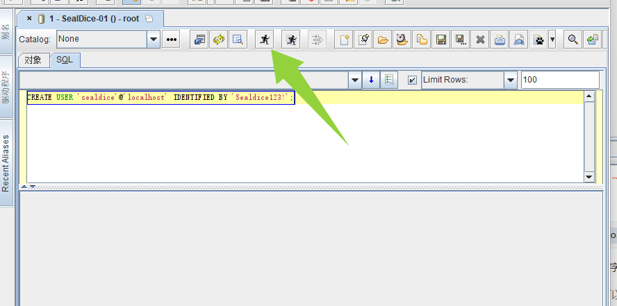

当看到如下提示，证明 SQL 执行成功：

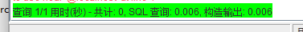

这时，可切换回对象选项卡，在 `USERS` 处右键 - 刷新缓存，查看新创建的用户：

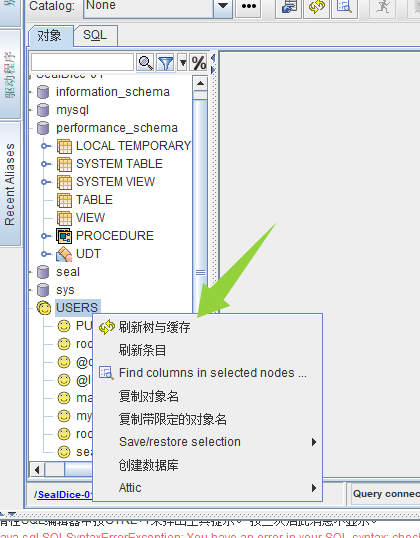

接下来，我们要将刚刚我们创建的数据库“分配”给这个用户，切换到 SQL 选项卡，输入如下的 SQL：

```SQL
-- 授予 sealdice@localhost 对 seal 库的所有权限

GRANT ALL PRIVILEGES ON seal.* TO 'sealdice'@'localhost';

```

```SQL

-- 刷新权限（使更改生效）

FLUSH PRIVILEGES;

```

请注意：如果你在前文中，修改了 localhost 为其他地址，你需要在这里一并修改。在 MySQL 中，他们被视为不同的用户权限。

而后，将上面的所有 SQL 语句全部选中后单击运行按钮（若不全选，有可能只执行其中一个）：

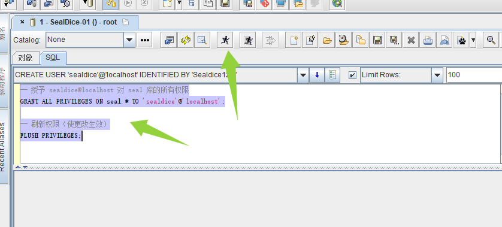

同样的，可以在最下方查看结果：

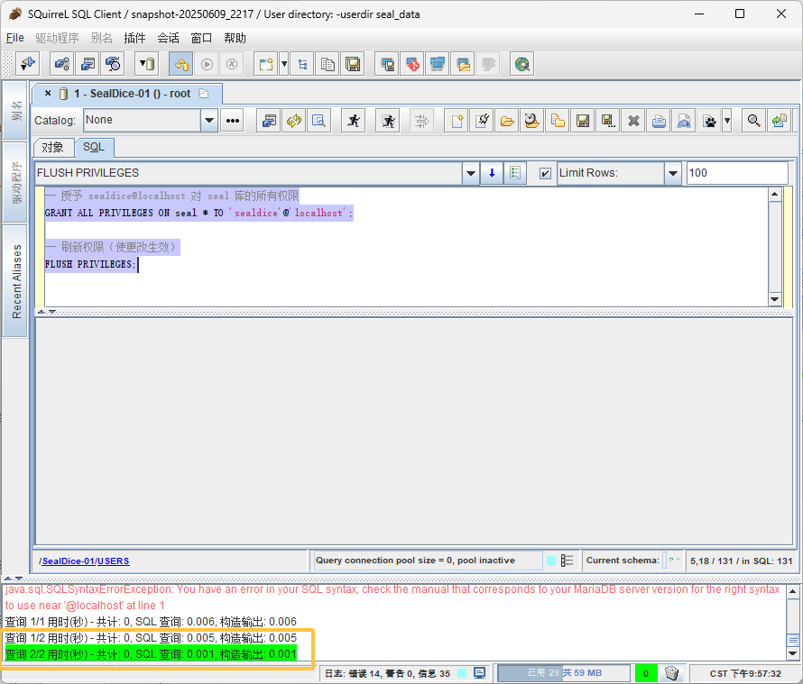

#### 使用海豹进行连接

解压一个成品海豹，并在目录下创建 `.env` 文件（注意，在 env 前有一个点，请勿漏写）：

::: tip 提示：

如已创建了 `.env` ，最后却不生效，请检查拓展名是否改对，你可以直接在 Squirrel SQL 里复制一个 `.env` 文件。

:::

在 `.env` 文件中填写如下内容：

``` .env
DB_TYPE=mysql
DB_DSN="sealdice:Sealdice123!@tcp(127.0.0.1:3306)/seal?charset=utf8mb4&parseTime=True&loc=Local"

```

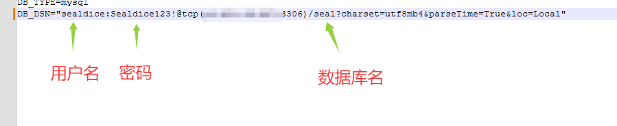

而后，保存并运行海豹。

其中，`sealdice` 和 `Sealdice123!` 为创建的新用户的用户名和密码。seal 为数据库名。如果您没有创建新用户，使用 root 和你设置的密码。

::: warning 注意：

如果你需要从一个有数据的海豹迁移，在操作这个步骤前，请先将目录下的 upgrade_metadata.json 改名为其他名称，否则，150 版本的海豹数据库将无法正常创建！

:::

如果没有意外，你的海豹应当正常加载了 MySQL 数据库：

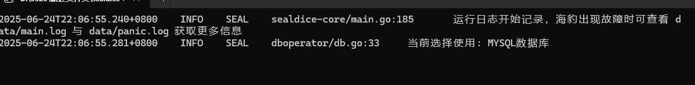

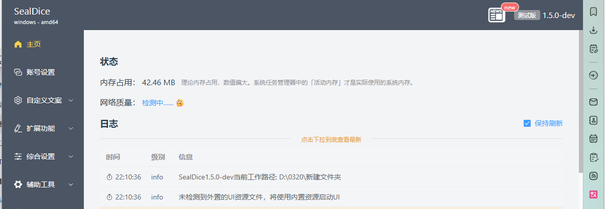

在对应的 seal 数据库下，也能查看到对应的 TABLE (请记得刷新)：

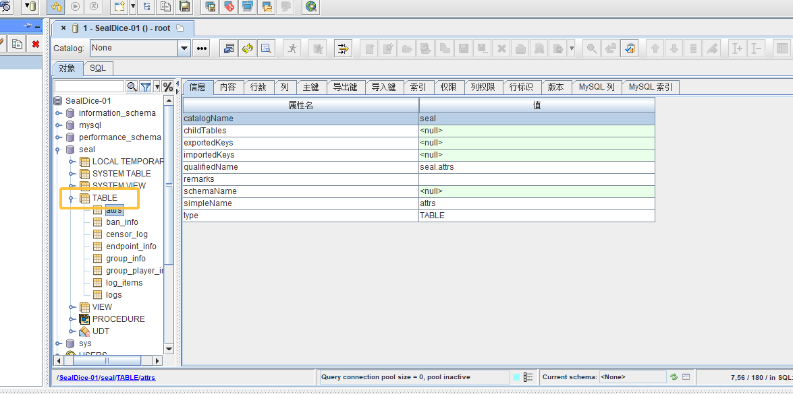

若需要查看数据，可以点击内容：

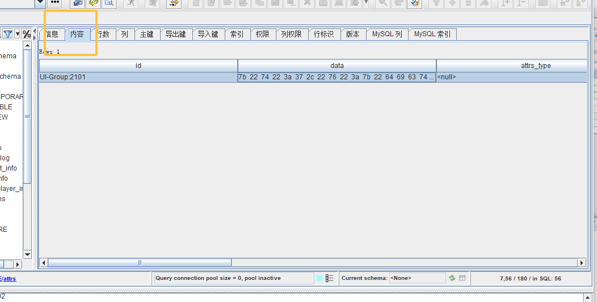

如果注意到某些数据是二进制的，双击如图所示的数据，并单击 `Reformat` ：

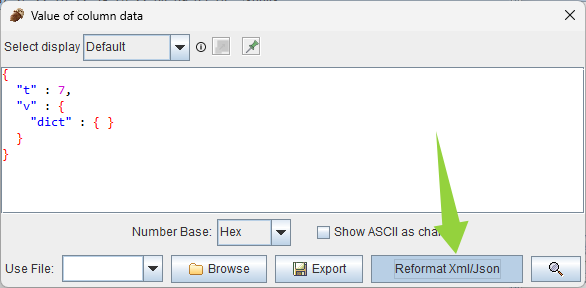

即可查看数据的信息。
