# QQ 官方机器人 <Badge type="tip" text="v1.6.0" />

海豹从 <Badge type="tip" text="v1.4.2"/> 开始支持对接 QQ 官方的机器人服务。

::: info 本节内容

本节将包含你在 QQ 官方机器人平台接入海豹核心需要了解的特定内容。

:::

::: tip 提示：QQ 机器人

QQ 官方目前已开放了机器人功能，可进入 [QQ 开放平台](https://q.qq.com/#/) 进行申请。

搭建机器人官方请参考 [QQ 机器人文档](https://bot.q.qq.com/wiki/#/)。

QQ 官方机器人的开放范围、审核要求和接口能力可能调整，请以开放平台显示的内容为准。

从海豹 <Badge type="tip" text="v1.6.0" /> 开始，官方机器人适配已支持普通 QQ 群消息、C2C 单聊、群内非 `@` 消息、WebSocket 和 Webhook。频道、群聊和单聊能够使用的事件及发送能力仍受应用权限和 QQ 官方接口限制，不能假定与普通 QQ 账号完全一致。

QQ 官方机器人的优点，就是不用担心被风控。

:::

## 尝试一下

如果你想尝试一下这样的机器人，非常欢迎你使用海豹官方的骰子：

## 获取连接所需信息

要获取用于连接海豹的信息之前，你需要建立好一个 QQ 机器人应用。可前往 [QQ 开放平台](https://q.qq.com/#/) 进行申请，**实名**注册后，创建一个机器人应用。

创建完成后，进入机器人管理后台，切换到「开发设置」页面：

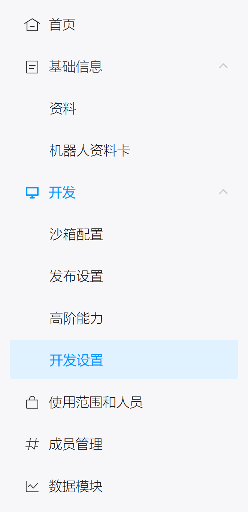

在页面中可以看到应用的 `AppID` 和 `AppSecret`。使用凭证方式连接海豹时需要这两项；旧版文档中的 Token 字段已经弃用。

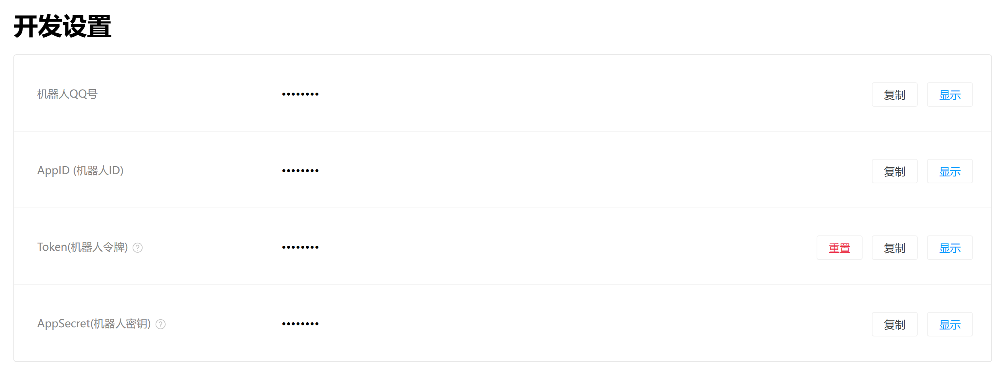

然后在「开发设置 IP 白名单」一栏中，填写你骰子所在电脑的 **公网** IP。（使用云服务器时，请填写对应云服务商在控制台提供的 IP）

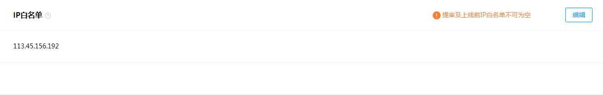

::: warning 注意：家庭网络的 IP 变动

如果你使用的是家用网络，在本地电脑运行海豹，要注意家庭网络的 IP 通常是不固定的，运营商随时可能会更换你的 IP，遇到问题时请先检查。

:::

## 连接海豹 <Badge type="tip" text="v1.6.0" />

登录海豹并添加账号，平台选择「QQ」，连接方式选择「QQ 官方机器人」。v1.6.0 提供两种登录方式：

- **二维码登录**：不手工填写 AppID 和 AppSecret，按页面提示生成二维码并扫码绑定。扫码完成后，海豹会取得应用凭证并自动建立连接。二维码过期、绑定失败或检测到同一应用已存在时，需要删除失败连接后重试。
- **应用凭证登录**：填写 QQ 开放平台提供的 AppID 和 AppSecret。此方式适合需要明确管理应用凭证或配置 Webhook 的部署。

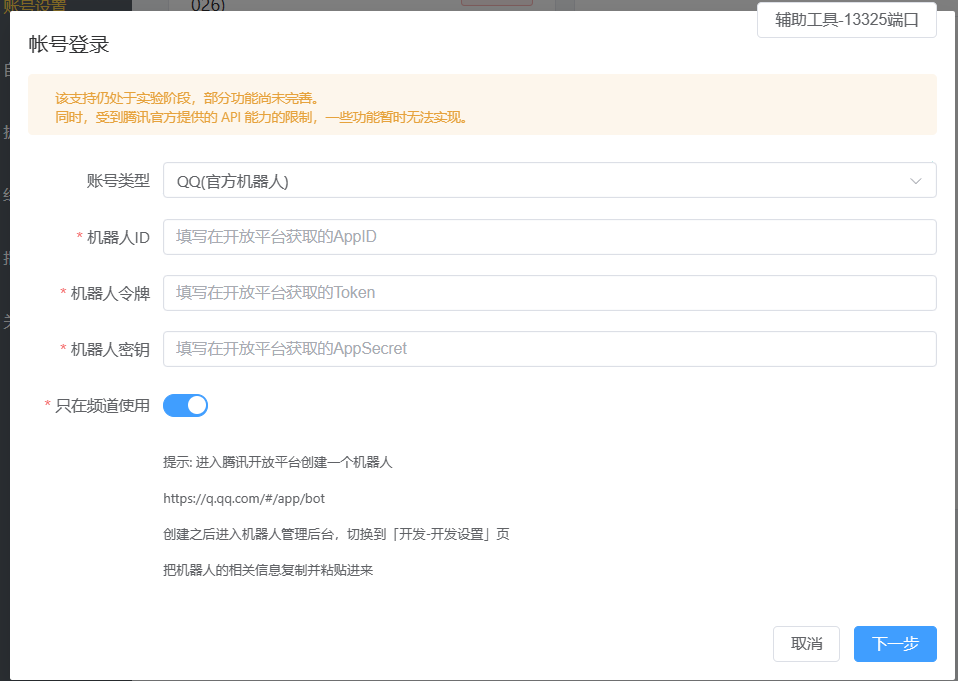

### WebSocket 与 Webhook

WebSocket 由海豹主动连接 QQ 官方服务，适合本机和大多数普通部署。Webhook 由 QQ 官方向海豹推送事件，适合已有公网 HTTPS 入口和反向代理的服务器部署。

选择 Webhook 时，需要在海豹连接表单中填写监听端口和回调路径，并在 QQ 开放平台配置与之对应的公网回调地址。公网入口、HTTPS 证书和反向代理由部署者维护；不要直接把海豹的管理端口暴露到公网。

## 指令配置

1. 进入「发布配置」页面；
2. 点击「功能配置」；
3. 点击「指令配置」；
4. 再点击右上角的「重新配置」开始编辑；
5. 点开「指令」页添加指令，「指令名」里面输入对应指令（例如 `r`、`ra`、`en`），`/` 是 QQ 官方机器人默认的指令前缀（海豹也支持使用 `/`）；
6. 然后在「指令介绍」一栏填写指令的简介；
7. 然后在「使用场景」一栏点击「QQ 频道」、「频道私信」、「QQ 群」，切记不能选中「消息列表」；
8. 确认配置完成后，扫码确认修改，就可以完成指令配置。

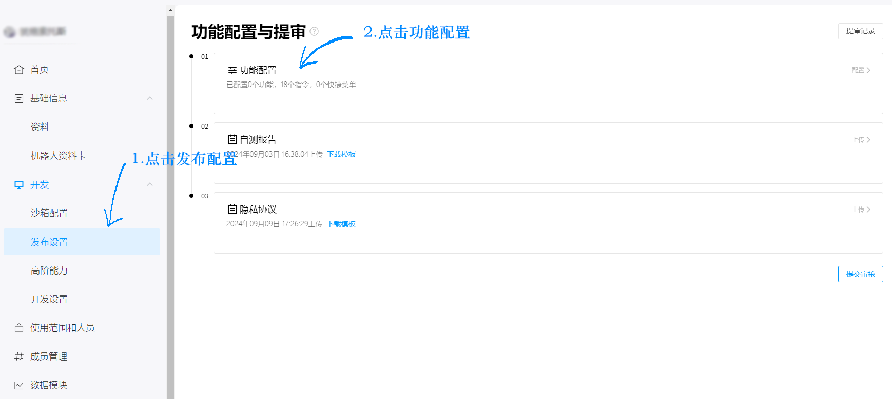

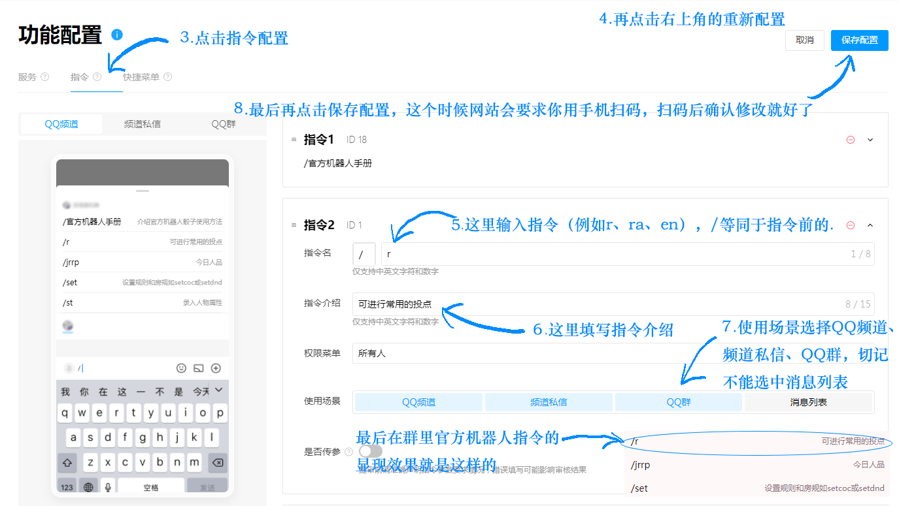

::: details 推荐指令列表模版

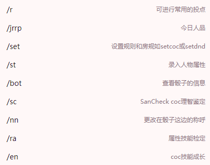

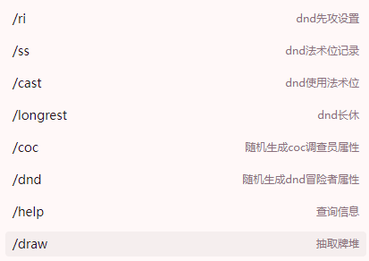

:::

## 机器人上线

点开「使用范围和人员页面」，进入「编辑」页，参考下面图片中编辑使用范围与人员。

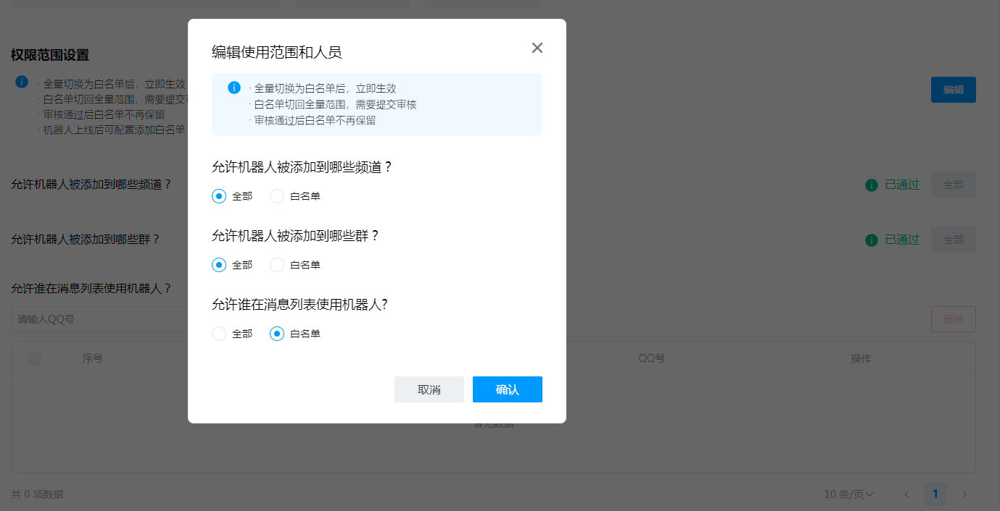

配置完成后，点击「发布配置」页面，上传「自测报告」与「隐私协议」。

<!-- autocorrect-disable -->
::: details 「隐私协议」与「自测报告」模板
<!-- autocorrect-enable -->

这里提供了海豹骰的机器人「隐私协议」与「自测报告」模版。

**强烈建议你按自身情况进行修改，绝对不要原样上传，这涉及到你的机器人是否能被 QQ 官方的工作人员审核通过。**

[机器人自测报告.xlsx](https://github.com/sealdice/sealdice-manual-next/blob/main/assets/%E6%9C%BA%E5%99%A8%E4%BA%BA%E8%87%AA%E6%B5%8B%E6%8A%A5%E5%91%8A.xlsx?raw=true)

[第三方机器人隐私保护指引.docx](https://github.com/sealdice/sealdice-manual-next/blob/main/assets/%E7%AC%AC%E4%B8%89%E6%96%B9%E6%9C%BA%E5%99%A8%E4%BA%BA%E9%9A%90%E7%A7%81%E4%BF%9D%E6%8A%A4%E6%8C%87%E5%BC%95.docx?raw=true)

如果你对「指令列表」的指令进行了修改，或者新增了其他功能，请自行修改，需要在「预期输出」一栏填「指令简介」。

:::

点击「提交审核」后，等待 QQ 官方人员测试并审核（时间不定）。审核通过后，在「发布设置」页面中点击「上线机器人」。

::: tip 提示：关于 QQ 审核

目前 QQ 审核主要是测试机器人能否在所选支持的场景下，正常回应指令列表里的指令（在没有添加任何其他内容前提下），为人工审核。

在提交审核前，请善用沙盒群，测试你提交的自测报告中，所提到的指令是否都能正常工作，机器人需要正常发出回应。

如果你的指令包含一些需要填写的参数，请务必在「自测报告」表格「特殊说明」一栏里补充说明。（你可以参考模板中对 `.ra` `.sc` `.en` 指令的特殊说明。）

如果审核未通过，点击右上角的「通知」查看原因，解决后再次提交。 如果实在无法解决，可加入「QQ 机器人官方频道」，在「寻求｜｜审核和及 bug 」一栏里，发帖询问。

:::

## 使用海豹

点击「使用人员与范围」页面，查看你的机器人对应的邀请二维码，扫码添加即可。

::: warning 平台限制

v1.6.0 已支持普通群消息、群内非 `@` 消息和 C2C 单聊，但应用必须在 QQ 开放平台取得对应场景和事件权限。收不到某类消息时，先检查应用的发布范围、事件订阅和审核状态。

QQ 官方接口存在消息频率、被动回复时限和媒体发送限制。海豹会拆分部分长消息，但密集发送、合并转发或某些本地媒体仍可能被平台拒绝；实际表现以开放平台返回的错误和当前权限为准。

:::

## 注意事项

大部分事项 [QQ 机器人文档](https://bot.q.qq.com/wiki) 都有说明，这里补充一些文档中没有说明的其他事项：

### 企业账号的开发者资质审核

如果你使用企业账号进行了注册，请记得在资料一栏中进行开发者资质状态审核。该审核需要将对应企业的银行卡号上传至腾讯审核，期间的等待时间可能较久。在开发者资质状态通过后，你才能将官方机器人送审。

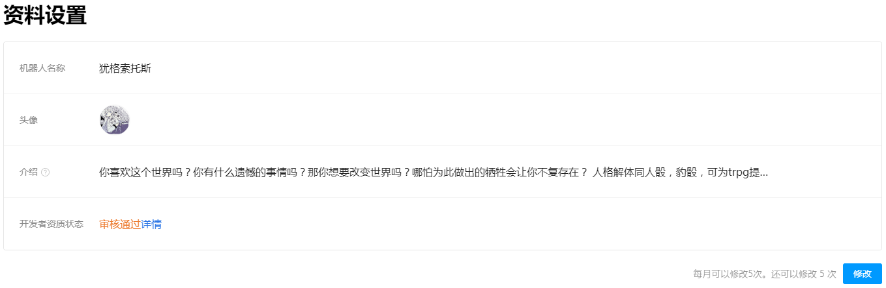

### 机器人官方频道跳转

机器人「资料卡」页面中资料卡设置一栏中，「机器人官方频道跳转」不能是骰子的「沙盒频道」。

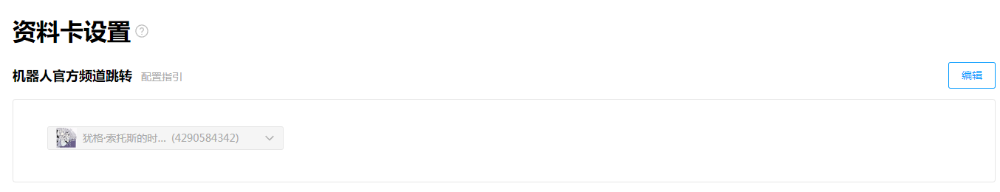

### 功能审核未通过

有时候「功能配置」页面中，「功能配置与提审」旁显示审核通过，但实际并没有通过，这时点击「机器人上线」的会显示发送错误。

遇见这种情况请点击「通知」，看机器人哪方面没过审，修改后再次提交审核。
