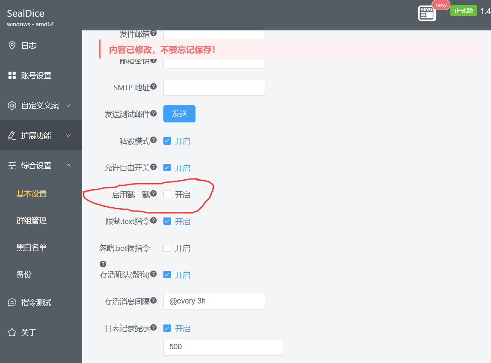

# QQ

::: info 本节内容

本节将包含你在 QQ 平台接入海豹核心需要了解的特定内容。

:::

## 前言

### 有关 QQ 平台机器人的说明

直至目前，绝大部分群聊中的 QQ 机器人采用「**假用户**」方式，即通过第三方软件接入注册的另一个 QQ。**QQ 官方一直在对第三方实现进行技术与非技术层面的多重打击。**

从目前的表现看来，QQ 官方会对账号行为进行检测，来区分出账号是否是正常用户（如不正常的登录方式，以不合理的速度在多地区登录等等）。我们无法得知具体的检测细节，但已证实的是，当 QQ 账号用作机器人并被检测到时，该 QQ 会视为风险账号，被官方予以警告，封禁，临时甚至 **永久冻结** 的惩罚。

尽管不同方案之间的差异很大（比如基于 Android QQ 协议的 Go-Cqhttp 已经**基本不可用**，而 [Lagrange.Milky](#lagrange-milky) 和 [NapCat](#NapCat) 等基于 NTQQ 的方案仍在维护），但需要明白的是，这些方案都由社区第三方软件提供，实质上以 QQ 官方角度等同于「**外挂软件**」，并不受到官方支持（甚至是被打击的目标）。

因此，*是否在 QQ 平台搭建这样的非官方机器人取决于你的慎重考虑*。同时，第三方方案的可用性也可能会随时间推移而存在变化，海豹官方无法做出任何保证。

目前，仅有 [官方机器人服务](./platform-qq-official.md) 是被 QQ 官方认可的机器人方案。其开放范围和具体能力由 QQ 开放平台决定。

如果有可能，建议迁移到其它平台，在 QQ 平台选择何种方式取决于你自己的选择。

::: danger

倘若出现账号被封禁等情况，海豹官方无力解决此类问题，也不对相应后果负责。

:::

### 对接引导

所有支持的途径参见目录，本节提供了多种对接途径的引导。

使用正式版 <Badge type="tip" text="v1.6.0" /> 时，非容器部署的新用户可从[内置客户端](#内置客户端)开始。需要自行维护协议端、跨主机连接或使用 Docker 时，再选择分离部署。

对于需要使用更加灵活的方案的用户，我们推荐如下：

- 需要由海豹管理 QQ 客户端进程的，见[内置客户端](#内置客户端)；
- 使用 OneBot 11 分离部署的，见 [LLBot](#llbot) 或 [NapCat](#NapCat)；
- 使用 Milky 分离部署的，见 [Lagrange.Milky](#lagrange-milky) 或 [Yogurt](#yogurt)；
- 通过 docker 部署海豹的，见 [QQ - Docker 中的海豹](./platform-qq-docker)；
- 如果你有 QQ 官方机器人权限，见 [官方机器人](./platform-qq-official.md)；
- Go-cqhttp 与 QSign 方案因可用性原因已被弃用。**我们不建议任何用户再使用此方式部署 QQ 接入，同时强烈建议正在使用该方案的用户迁移**。

不同的对接方式适应不同的情况，可能会存在途径特有的功能缺失和其它问题，请根据自己的情况选择适合的方式。

::: warning 注意：对接基于 NTQQ PC 端协议的 QQ 方案时，注意对方是否支持 `戳一戳` 功能

Lagrange.Milky、Yogurt、LLBot 和 NapCat 等基于 NTQQ PC 的 QQ 方案，在旧版本中可能缺失该功能。

使用旧协议端且持续出现报错时，请先更新对应实现；暂时无法更新的，应**关闭**位于 `综合设置` - `基本设置` 的 `启用戳一戳` 开关，以免产生不必要的报错信息。

:::

::: warning 注意

Lagrange.OneBot、Lagrange.Milky、Yogurt、LLBot 和 NapCat 都占用 PC 端协议。在使用这些连接方式时，不可同时登录 PC 端 QQ，否则将导致挤占下线。

由于 QQ 的登录策略，PC 端协议可能需要定期重新登录；实际周期以 QQ 登录状态为准。

:::

## 内置客户端 <Badge type="tip" text="v1.5.1" />

自<Badge type="tip" text="v1.5.1" />起，海豹核心可以直接启动自带的 `Lagrange.Milky` 或 `Yogurt`，并自动生成仅供本机使用的 Milky 连接地址、访问令牌和配置文件。

::: warning 使用限制

- Docker 等容器模式不能使用这两种内置客户端，请改用分离部署。
- 登录期间不要在电脑上同时登录同一 QQ，否则可能互相挤下线。
- 请使用完整的官方发布包。只替换 `sealdice-core` 可执行文件时，可能缺少对应客户端程序。

:::

### 内置 Lagrange.Milky

1. 打开海豹 WebUI，进入「账号设置」，点击添加账号。
2. 平台选择「QQ」，连接方式选择「内置 Lagrange.Milky」。
3. 填写作为骰子的 QQ 号并继续。
4. 等待页面显示二维码，用已登录目标账号的手机 QQ 扫码并确认。
5. 等待账号状态变为「已连接」。

二维码只在短时间内有效。页面提示二维码过期或账号状态变为「失败」时，删除这条失败的连接后重新添加并扫码。

### 内置 Yogurt

1. 打开海豹 WebUI，进入「账号设置」，点击添加账号。
2. 平台选择「QQ」，连接方式选择「内置 Yogurt」。
3. 填写作为骰子的 QQ 号并继续，其余连接参数由海豹自动生成。
4. 等待二维码出现，用目标账号扫码并确认。
5. 等待账号状态变为「已连接」。

Yogurt 是非容器部署时的默认内置选择。二维码过期后需要删除失败连接并重新添加，不能继续扫描旧二维码。

## 分离部署

::: info 分离部署

不同于内置客户端，分离部署为海豹核心和 QQ 登录框架分别启动，然后按照各个框架的连接协议将海豹核心和 QQ 登录框架连接起来。

相比之下分离部署有更强的稳定性，但操作难度也有一定程度的增加。

:::

::: danger 公网机器部署时的端口暴露风险

分离部署时，会启用比内置登录更多的网络服务。请在配置防火墙时留意，避免这些服务端口暴露于公网。如确需公网访问，请设置强密码，以保障骰子安全。

:::

### Lagrange.Milky <Badge type="tip" text="v1.5.1" />

海豹从 <Badge type="tip" text="v1.5.1"/> 开始支持通过 `Lagrange.Milky` 接入 Milky。

`Lagrange.Milky` 是基于 Lagrange.Core.V2 的 Milky 协议实现。

#### 下载 Lagrange.Milky

请按照 [Lagrange.Milky](https://github.com/LagrangeDev/Lagrange.core)和 [Lagrange.Milky 文档](https://lagrangedev.github.io/Lagrange.Milky.Document/) 自行完成安装、登录和配置。

#### 海豹连接

启动协议端后，在海豹 WebUI 的「账号设置」中，在「账号类型」处选择「QQ」,在「QQ 协议」处选择「Milky 协议 (分离)」添加 Milky 连接，填写 Lagrange.Milky 实际配置文件中提供的 WebSocket、HTTP API 地址 和`Token`。

### Yogurt <Badge type="tip" text="v1.5.1"/>

海豹从 <Badge type="tip" text="v1.5.1"/> 开始支持通过 `Yogurt` 接入 Milky。

[Yogurt](https://github.com/SaltifyDev/milky)是基于 acidify-core 实现的 Milky 协议端。

#### 下载 Yogurt

请参照[Yogurt 手册](https://acidify.ntqqrev.org/docs/yogurt/start) 进行安装、登录以及配置。

#### 海豹连接

启动协议端后，在海豹 WebUI 的「账号设置」中，在「账号类型」处选择「QQ」,在「QQ 协议」处选择「Milky 协议 (分离)」添加 Milky 连接，填写 Yogurt 实际配置文件中提供的 WebSocket、HTTP API 地址 和`Token`。

成功连接后即可使用。

::: warning 注意：

`Yogurt` 与 `Lagrange.Milky` 需要自行申请 Signer Token 并配置到配置文件中，否则，可能无法正常启动。获取 Signer Token 参见 [文档](https://github.com/LagrangeDev/SignApiGuide)，此处不做赘述。

:::

### LLBot

[LLBot](https://github.com/LLOneBot/LuckyLilliaBot)是原 LLOneBot、现 LuckyLiliaBot 项目当前使用的官方简称。 `LLOneBot` 或 `LLTwoBot` 均指这一项目的早期名称。为防止误解，本手册统一使用 `LLBot` 对该项目进行代称。

请按照 [LLBot 文档](https://luckylillia.com/)完成安装并启用 OneBot 11 正向或反向 WebSocket。
随后在海豹 WebUI 的「账号设置」添加对应的 OneBot 11 连接；端口、访问令牌。

成功连接后即可使用。

::: warning 注意：

在 `v8.0.9` 以及之后版本的 LLBOT，可能需要向 LLBOT 开发组申请 AUTH TOKEN，详细申请流程请自行加入 LLBOT 用户群完成，不在此进行赘述。

:::

### NapCat

::: info NapCat

[NapCat](https://github.com/NapNeko/NapCat) 是在后台低占用运行的无头（没有界面）的 NTQQ，具体占用会因人而异，QQ 群、好友越多占用越高。

[NapCat 官方文档](https://napneko.github.io)

:::

::: warning 使用此方案的用户请注意不要随意 *更新* QQ 客户端。

由于 QQ 客户端检测机制的变化，更新 QQ 客户端后可能导致方案不可用，并且更新后需要重新安装登录框架，所以不建议用户随意更新 QQ 客户端。

:::

NapCat 是基于官方 NTQQ 实现的 Bot 框架，因此在开始前，你需要根据 [NapCat](https://napneko.github.io/guide/start-install) 的手册安装官方 QQ，若 QQ 版本过低会导致程序无法正常启动。

#### 下载 NapCat

请按照 [NapCat 官方手册](https://napneko.github.io/guide/start-install) 下载安装，然后按照 [基础配置](https://napneko.github.io/config/basic) 和自己的需求修改配置文件。

#### 海豹连接

进入海豹 Web UI 的「账号设置」新增链接，按照自己的配置文件选择 onebot11 账号类型，填写 QQ 号和「连接地址」。

成功连接后即可使用。

### Chronocat <Badge type="tip" text="v1.4.2" />

从 <Badge type="tip" text="v1.4.5"/> 开始适配了与 Chronocat 的 Satori 协议连接。

#### 安装 Chronocat

请按照 [官方手册](https://chronocat.vercel.app/guide/install/shell) 安装 Chronocat。

#### Chronocat Satori 协议 <Badge type="tip" text="v1.4.5" />

在账号添加中，选择「[WIP]Satori」，填写相应信息进行连接。
