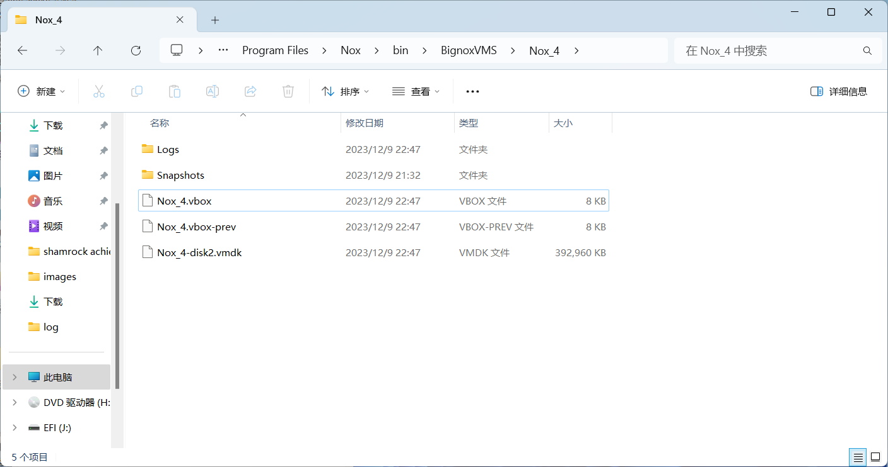

# QQ

::: info 本节内容

本节将包含你在 QQ 平台接入海豹核心需要了解的特定内容。

:::

## 官方机器人 <Badge type="tip" text="v1.4.2" vertical="middle" />

海豹从 `v1.4.2` 开始支持对接 QQ 官方的机器人服务。

::: warning QQ 机器人

QQ 官方目前已开放了机器人功能，可进入 [QQ 开放平台](https://q.qq.com/#/) 进行申请。

但截止到目前，**QQ 官方机器人的群聊权限并未对所有人开放**。我们也希望在未来，每个人都能轻松地对接上官方提供的机器人服务。

同时，由于 QQ 官方对机器人能力的严格限制（包括获取 QQ 号、昵称，非 @ 时响应，私聊，群控等大量功能目前不支持），目前**对接官方接口的骰子很多功能无法支持**（如跑团 Log，暗骰，对抗等）。

:::

### 尝试一下

如果你想尝试一下这样的机器人，非常欢迎你使用海豹官方的骰子：


### 获取连接所需信息

要获取用于连接海豹的信息之前，你需要建立好一个 QQ 机器人应用。可前往 [QQ 开放平台](https://q.qq.com/#/) 进行申请，进行**实名**注册后，创建一个机器人应用。

创建完成后，进入机器人管理后台，切换到「开发设置」页面：


在页面中你可以看到这样的信息，其中「机器人ID」「机器人令牌」「机器人密钥」这三项是海豹进行连接所需要的。


### 连接海豹

登录海豹并添加账号，选择「QQ(官方bot)」。填写对应的信息点击连接。你的海豹应该可以正常连接官方机器人运作了！


### 使用海豹

::: warning 注意

目前官方机器人只响应包含 `@` 的消息，操作时请注意。

:::

## Shamrock <Badge type="tip" text="v1.4.2" vertical="middle" />

海豹从 `v1.4.2` 开始适配了 Shamrock 的连接。

::: info Shamrock

[Shamrock](https://whitechi73.github.io/OpenShamrock/) 是一个基于 [LSPosed](https://github.com/LSPosed/LSPosed)/Xposed 框架，实现劫持 QQ 以对外暴露 Onebot Api 的软件。你可以在 Android 手机/模拟器中使用 Shamrock 代替已经停止开发的 gocq。

遗憾的是，Shamrock 的使用依赖于 Android 的 root 权限，而手机厂商对 root 管控愈加严格，实体手机获取 root 权限的门槛很高，而模拟器中使用 Shamrock 的效果也不是很可观。因此，这种解决方案适合个人与朋友使用骰子的场景。

此外，如果你想使用 Shamrock 代替 gocq，请确保你有良好的计算机使用能力。

本节主要讲解如何使用模拟器实现 Shamrock，如果你有一台已经 root 的手机，也可以参考本节内容，**本教程不涉及说明如何 root 手机**。

:::

::: warning 低配置设备可能无法使用 Shamrock！

在尝试通过模拟器使用 Shamrock 的场景下，由于模拟器对性能要求较高，包括 **轻量级服务器**、旧电脑、小主机等配置较低的设备可能无法支持使用。

:::

### 准备模拟器

下面将使用 [夜神模拟器](https://www.yeshen.com/) 作为示例。

使用时，确保安卓版本在安卓 8 以上，而在安卓 11 以下，最好使用安卓 9。

### 获取 Root 权限

::: tip Magisk

Magisk（面具）是一套开源的 Android 自定义工具，通常用于获取 root 权限。

Root 即 Android 的超级用户权限，如对 QQ 应用进行注入等的危险操作需要 root 权限。

:::

*在使用之前，请在模拟器设置中打开 root 选项，软件中获取的一切权限都给予 **通过**，包括 **root 权限**。*

使用 [面具安装工具](https://cowtransfer.com/s/9794ead1113d47)，把它安装到模拟器。 

然后启动软件，输入 `m` 回车，再输入 `y` 回车，会索取超级用户权限，给予，然后输入 `1` 回车，再输入 `a` 回车，输入 `1` 回车，此时面具就安装到你的模拟器上了。

打开面具模块，此时面具会索取超级用户权限，给予，此时你会发现你的超级用户权限那里是灰的，**关闭你的超级用户权限**，重新启动你的模拟器。

**此时你会发现你的超级用户模块已经激活**。在面具的设置里启动 `zygisk` 模块，随后你需要再次重启模拟器，使得 `zygisk` 模块生效。


### 安装 LSPosed 模块

请于 [LSPosed Releases](https://github.com/LSPosed/LSPosed/releases) 页下载模块。

::: warning zygisk

**务必**选择以 `zygisk` 结尾的包。

:::

下载完成后，把文件上传到模拟器中。一般情况下，直接把文件拖动到模拟器就可以传文件了，且文件一般在 `picture` 文件夹中，如果没有请参照你使用的模拟器说明。

在你传完文件之后，在最右侧切换到「模块」页后，你可以看到从本地安装的选项。单击你刚刚传到模拟器里的文件，等待安装完成即可，随后你可以在右下角看到重启按钮，点击等待重启。

安装完成后应该如下所示：


### 安装 Shamrock

请于 [Shamrock Releases](https://github.com/whitechi73/OpenShamrock/actions/workflows/build-apk.yml) 下载 Shamrock 的 apk 安装包，直接将 apk 文件拖动到模拟器即可进行安装。

如果模拟器中没有安装 QQ，此时你还需要将 [QQ](https://im.qq.com) 安装到模拟器中。

安装完成后，**首先启动 Shamrock**。在通知上，你可以打开 LSPosed 的页面，在**模块一栏中启用 Shamrock**。


选中 Shamrock，进入勾选 QQ，并长按 QQ 选择 **强行停止**。


随后再打开 QQ，你可以看到「加载 Shamrock 库成功」的提示，这代表 Shamrock 已经成功注入了 QQ。

成功注入后，打开 Shamrock 启用 ws 服务，通常情况下无需修改 Shamrock 的任何内容，如有其它需求请阅读 [Shamrock 文档](https://whitechi73.github.io/OpenShamrock/)。


### 开放模拟器端口供海豹对接

首先下载 [adb](https://developer.android.google.cn/studio/releases/platform-tools?hl=zh-cn) 工具，解压到电脑中任何可用的位置。

随后找到模拟器供 adb 连接的端口，夜神模拟器路径示例如下：



其中：
- `Nox` 是模拟器根路径。
- `Nox_4` 是模拟器的编号，你可以在多开助手中看到你的编号。
- 选中的文件就是要找的文件，在 vscode 中（或者其它文本编辑器）中打开。


`guestport` 值为 `5555` 的 `hostport` 即为所需端口，如示例中就是 **62028**，记住这个端口号。

在你解压的 `platform-tools` 里打开终端，或者把 `platform-tools` 加入环境变量后再启用终端。也可以在 `platform-tools` 里新建一个 `.bat` 文件，把下面的命令写到文件里面。

在打开的终端中输入命令：

```cmd
.\adb connect 127.0.0.1:端口
```

如替换为上面示例中的 **62828**:

```cmd
.\adb connect 127.0.0.1:62028
```

随后再执行：

```cmd
.\adb forward tcp:5800 tcp:5800
```

此时你已经成功开启端口了。


### 对接海豹

在账号添加中，选择「QQ 分离部署」，按照下面的格式进行填写：


成功连接后即可使用。

## Lagrange <Badge type="tip" text="v1.4.2" vertical="middle" />

海豹从 `v1.4.2` 开始适配了 Lagrange（拉格兰）的连接。

在账号添加中，选择「QQ 分离部署」，填写相应信息进行连接。

::: note 施工中……
:::

## Chronocat <Badge type="tip" text="v1.4.2" vertical="middle" />

海豹从 `v1.4.1` 开始适配了 Chronocat（超时空猫猫）中 Red 协议的连接，在 `v1.4.2` 版后连接更稳定。

在账号添加中，选择「QQ Red 协议」，填写相应信息进行连接。

::: warning Chronocat 已停更

[Chronocat](https://chronocat.vercel.app/) 已经停止更新，同时作者也不希望互联网上再有其相关教程，故海豹也不提供指导，请自行寻找相关内容。

:::

## Go-cqhttp / Mirai

::: danger 不被 QQ 官方欢迎的第三方机器人

直至目前，绝大部分群聊中的 QQ 机器人采用「**假用户**」方式，即通过第三方软件接入注册的另一个 QQ 。**QQ 官方一直在对第三方实现进行技术与非技术层面的多重打击。**

从目前的表现看来，QQ 官方会对账号行为进行检测，来区分出账号是否是正常用户（如不正常的登录方式，以不合理的速度在多地区登录等等）。我们无法得知具体的检测细节，但已证实的是，当 QQ 账号用作机器人并被检测到时，该 QQ 会视为风险账号，被官方予以警告，封禁，甚至 **永久冻结** 的惩罚。

因此，*是否在 QQ 平台搭建这样的非官方机器人取决于你的慎重考虑*，复杂的部署方式是**现状下几乎唯一的选择**。海豹官方无法做出任何保证。倘若出现账号被封禁等情况，海豹官方无力解决此类问题，也不对相应后果负责。

如果有可能，建议迁移到其它平台，或者使用 [QQ 官方提供的机器人服务](#官方机器人服务)。

:::

### 使用签名服务

::: danger qsign 已停止维护

原 qsign 作者已因「不可抗力」无法再维护此项目，对应原代码仓库也已删除，该方法会在未来逐渐失效，请做好预期准备。

:::

部署签名服务，即使用开源签名服务 [qsign](https://github.com/fuqiuluo/unidbg-fetch-qsign)，是目前用来绕过检测的最有效手段。

#### 怎么使用签名服务？

你可以自己在本地搭一个 qsign 服务，也可以使用别人搭好的。

::: warning 自行搭建签名服务

如果你的动手能力足够强或者有足够的电脑知识，**强烈推荐** 自己搭建本地签名服务器。

使用他人的签名服务可能会泄漏以下信息 *（截取自 qsign 的说明）*：
> - 登录账号
> - 登录时间
> - 登录后发送的消息内容
> - 登录后发送消息的群号/好友 ID

不会泄露的信息：
> - 账号密码
> - 账号 `session`
> - 群列表/好友列表
> - 接收的消息
> - 除发送消息外的任何历史记录

使用共享签名服务可能会提高账号被封禁的概率。

:::

在登录账号的时候会看到这样一个界面：


点击下面的「签名服务」一栏的「简易配置」，可以看到如下配置项：


- 服务 url：你要链接的 qsign url
- 服务 key：密码
- 服务鉴权：默认为空，如果有的服务器要求特定的鉴权，就填上吧

::: note 默认的 qsign 配置

没有特殊设置的话，qsign 的 url 通常默认为 `http://localhost:13579`，key 通常默认为 `114514`。

:::

#### 如何搭建签名服务

::: tip 有能力的用户可以自行搭建服务。
:::

::: tabs#os

@tab Windows#windows

可以尝试使用 [一键qsign](https://github.com/rhwong/unidbg-fetch-qsign-onekey)。

引用自说明：
> 点开以后删掉文件夹里的 `go-cqhttp.bat` 及 `go-cqhttp_windows_386.exe`，然后运行里面的 `Start_Qsign.bat` 启动qsign，按照提示依次键入 `txlib_version` 参数、设定 `host`、`port`、`key`的值。（如果不知道这些是干什么的，请直接依次按下 Enter）

@tab Linux#linux

参阅 qsign 提供的完整教程，看 [这里](https://github.com/fuqiuluo/unidbg-fetch-qsign/wiki/%E9%83%A8%E7%BD%B2%E5%9C%A8Linux)。

@tab MacOS#macos

可以尝试使用 [AutoQSignForMac](https://github.com/Verplitic/AutoQSignForMac)。

在终端运行 `start.sh` 即可配置和启动签名服务器。如果提示 `zsh: access denied`，需要先运行 `chmod -x start.sh`来给予权限。

初次启动会选择 txlib 版本，及运行 QSign 的主机、端口和 API Key。通常情况下，可以回车跳过而使用默认配置。

:::