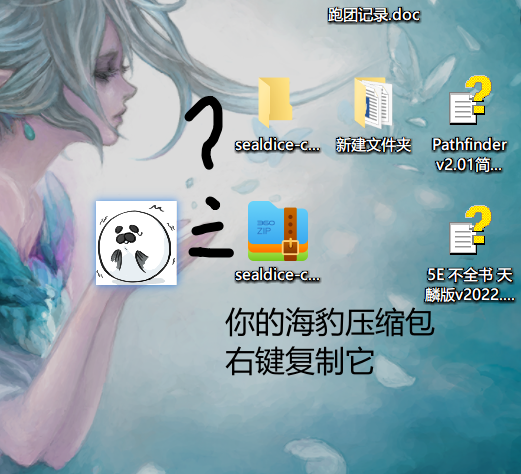

# 迁移与上云

::: info 本节内容

本节将会指导你如何迁移现有的海豹核心。

:::

海豹核心的数据文件全平台通用。因此，在不同平台间迁移时，你只需要准备每个平台的可执行文件。

::: warning

在进行任何迁移时，你都应**确保**迁出和迁入的海豹核心都**未在运行**，否则可能造成不可逆的数据损坏。

:::

## 相同平台间迁移

将整个海豹核心目录复制到新的位置即可。

如果目录体积较大，你可以自行删除 `backups/` 下的备份文件。这不会造成数据损失。

## 跨平台迁移

跨平台迁移时不能使用旧的可执行文件，而只迁移数据部分。

将迁出海豹核心中的 `data/` 目录以你习惯的任何方式打包。

在迁入平台准备一份全新的海豹核心，用打包的数据覆盖迁入海豹的对应目录。

如果你希望保留旧的备份文件，你可以复制迁出海豹 `backups/` 目录中的内容，放置于迁入海豹的对应目录。备份文件也是通用的。

### Linux 服务器间跨架构迁移（arm64 → amd64）

步骤与普通跨平台迁移一致。在运行新海豹核心时，如果文件权限不正确，可以在海豹核心目录下执行以下两条命令：

```bash
find . -type f | xargs chmod 644
find . -type d | xargs chmod 755
```

## 迁移数据到手机

如果你需要把电脑海豹的数据迁移到手机海豹上，同样是迁移海豹的 `data/` 目录。步骤如下：

1. 关闭你的电脑海豹，复制电脑海豹的 `data/` 目录发送到手机上。
2. 点击手机海豹的 **导出数据** 按钮，在设置中勾选 **文件同步模式**。（平时推荐关闭这个选项，这里是为了替换数据库特别地需要开启）
3. 在你习惯的手机文件管理软件中找到 `根目录/document/com.sealdice.dice/sealdice`，用迁出海豹的 data 目录替换这里面的 data 目录。
4. 回到手机海豹的界面中点击 **导入数据**。导入完成后再点击启动核心，这时你的手机海豹里就应该是旧海豹的数据了。导入完成后也可以把「文件同步模式」关闭了。

::: warning

在手机海豹上，每次导入数据前都进行一次导出，导出后不要再运行海豹核心。

这是因为，手机海豹**不会**实时更新导出的文件，它们是海豹数据在导出时的一份快照。

如果在上次导出后产生了新数据，而再次进行导入，会导致新产生的数据被之前导出的数据覆盖，丢失这段时间以来录入的角色卡、Log、修改的自定义文案等海豹内部的数据。

:::

## 上云

### 前情提要

- 使用本教程的前提是你已经购置完成了服务器，且在本地登录成功。

- 本教程以腾讯云为演示，各家云服务商服务器控制台相差不大，找不到地方请询问群友或使用搜索引擎，优先参考对应云服务商的官方指南。

- 本教程默认你的电脑和服务器都为Windows系统，Mac稍后说明。具体版本无要求，它们的差异不大。

- 服务器购买教程可以看[这个视频 P1](https://www.bilibili.com/video/BV1uq4y1c7Xe/)的3:33-10:46，软件不一样但内容类似，本教程提到的其他内容在其中也有呈现。

### 服务器控制台设置

在服务器官网打开控制台。


根据你购买的服务器类型（标准/轻量），进入对应的页面，二者差异不大，这里以轻量应用服务器为例。


进入你买的服务器的控制界面，放行 3211 端口。


进行密码重置，按提示依次进行，记住密码和用户名。


### 远程链接服务器

#### Windows

腾讯云[官方指南](https://cloud.tencent.com/document/product/1207/44579)，可供参考，下面是 Win10 版本操作示范。

按窗户键/ win 键，输入“远程桌面连接”，打开程序。


点击显示选项。


保存好 rdp 文件，后面双击就能连接服务器。


输入密码连接服务器。


之后会弹出几个警告窗口，全部选择确定，可以点击“不再显示”让下次连接不出现。

#### Mac系统

参考教程 [MacOS 远程桌面控制 Windows](https://blog.devhitao.com/2019/03/23/microsoft-remote-desktop-for-mac/)，其他与上述类似。

### 复制海豹并启动

关闭海豹，将海豹文件夹打包成压缩包。


简单的复制粘贴，当远程桌面启动之后，你的电脑和服务器某种意义上是一体的，所以它们共享剪贴板。




粘贴完后解压文件夹并打开，如同本地运行一般即可完成上云。

### 远程访问海豹ui

打开浏览器，在地址栏输入`服务器IP:海豹端口`,打开网址。


