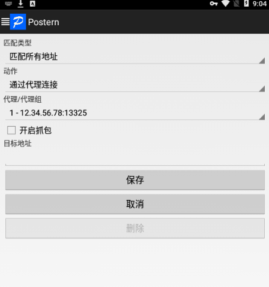

# 常见问题

::: info 本节内容

本节将提供一些常见问题的解决方式，方便快速解决。如果你的问题并没有在这里得到答案，欢迎加入官方群寻求帮助。

:::

##  为啥海豹不理我？

可能性一：私聊非好友

可能性二：遭到了风控发不出来。

可能性三：请检查当前开启的扩展，例如当coc7扩展关闭时，sc等指令是不会回应的。请运行`.ext coc7 on`开启对应扩展。

骰主可以后台查看骰子接收到的指令和反馈，风控也会提示。

另外骰主在海豹后台可以直接试指令。

如果确实是没反应！！请加入海豹群反馈！

##  可以关闭暗骰吗？

海豹不会去私聊非好友帐号，所以不必担心暗骰会影响帐号安全。

##  退群指令？

以下指令均可：

```
.bot bye
.bot exit
.dismiss
```

骰主也可以后台在群组管理中操作退群。

##  登录服务器开浏览器使用好麻烦！能远程直接访问UI吗？

可以，对于大部分VPS，可以使用http://IP:3211 （IP是你服务器的IP）直接访问后台

像是腾讯云轻量服务器，需要进行设置“**服务器管理 - 防火墙 - 添加端口 3211，TCP**”

白嫖的Oracle Linux服务器，不仅需要后台设置，还需要放行端口：

```bash
sudo iptables -I INPUT -s 0.0.0.0/0 -p tcp --dport 3211  -j ACCEPT
```

Windows服务器也一样，需要额外关闭内置防火墙，或者设置端口放行。

**千万记得在基本设置中设置密码！！！**


##  在服务器上登录时说「需要在同一WIFI下扫码」怎么办

首先确认使用安卓协议，并且输入密码登录（不要使用无密码的扫码登录，现在已经很不好用了）。


有几种办法：

1. **[首选] 让手机跟服务器真的处于同一个网络**

   此方法本来是方案3，随着时间推移以及审核的严格，现在逐渐成为了最佳方案。

   这个办法略微繁琐，不过好在一劳永逸。

   

   **步骤一: 配置防火墙**

   以腾讯云轻量服务器为例，点入“服务器”，再点击卡片。

   

   

   进入后点击“防火墙”，随后“添加规则”，这里选择TCP协议，端口输入13325（演示图片中为13326），点击确定。

   

   搞定，其他服务商大同小异。

   已知需要做此配置的服务商有：**腾讯云轻量服务器、阿里云、华为云**。

   

   **步骤二：服务器端运行工具**

   **在V1.1.0 v20221231更新后**，在海豹骰中集成了socks工具。

   点击图中`辅助工具-13325端口`按钮。

   

   稍等片刻后，出现如下窗口。

   

   点击OK。

   

   **V1.1.0 v20221231以下版本**可以手动下载socks工具。

   如果你是windows服务器就下载`socks5_0.2_windows_amd64.zip`，地址:

   https://github.com/fy0/socks5-tool/releases

   

   运行起来之后，显示一串这样的文本：

   ```0
   http/socks5简易工具©sealdice.com
   将在服务器上开启一个socks5服务，端口13325，默认持续时长为25分钟
   将在服务器上开启一个http代理服务，端口13326，默认持续时长为25分钟
   
   可能的公网IP:  12.34.56.78
   请于服务器管理面板放行你要用的端口(一般为13325即socks)，协议TCP
   如果是Windows Server 2012R2及以上系统，请再额外关闭系统防火墙或设置规则放行
   
   正在启动服务: 0.0.0.0:13326
   正在启动服务: 0.0.0.0:13325
   ```

   >  特别的，如果是Windows Server 2012R2及以上系统，请再**额外关闭系统防火墙**或设置规则放行。具体做法搜索关键字`Windows server 关闭防火墙`

   

   **步骤三：手机端连接**

   你需要一个代理软件，比如postern程序，如果可能的话你可以从Google play下载，你也可以在用户群里找到它。

   然后在你将要扫码的手机上启动它，弹出的窗口都点击**确定**。

   点击默认存在在的代理，将他**删除**，然后点击**添加代理服务器**，按照下图填写。

   

   **保存**后点击左上角Postern的图标，点击**配置规则**，类似前文删除代理，**删除**掉默认的规则1和规则2，然后点击**添加规则**。如图选择匹配类型和动作，之后会自动填入代理/代理组。

   

   **保存**后重启软件。

   现在就配置完成了，手机上打开浏览器进入 https://ip138.com/ 如果显示的IP地址和服务器一样，那么配置正确。如果打不开网页或提示"当前wifi不能访问网络"，可能是防火墙没配置好。如果IP不一样，可能是代理没配置上。

   **如果你是IOS手机，可以使用Potatso替代Postern。**

   **现在可以进入海豹UI，重新进行登录流程了。如果以后再出类似情况，直接重复步骤二、三即可**

2. 本机上完成扫码登录，然后将登录过的配置文件覆盖到服务器上。

   具体目录是 **data/default/extra/go-cqhttp-qq12345**

   当然如果你没做过自定义配置，可以整个复制。

3. 使用密码登录，重试3次左右，有概率直接上号


##  @其他骰子做检定的时候，海豹也会回应，怎么办

首先更新到0.99.8以后的版本。

使用这个指令将其他骰子进行标记:

```
.botlist add @骰子A @骰子B
```

会有如下效果：

1. 当有人@该骰发指令，海豹不会做出回应
2. 该骰发出的指令和消息，海豹不会回应，这可以有效避免关键词触发的无限复读

之所以不保留传统@效果，是因为海豹基于@功能做了一项扩展，其适用场景远多于同群多骰。

具体可以参见文档的这一节：**ra/rc 指令 -> [对他人做检定](#对他人做检定)**


##  为啥好像反应慢一拍

首先确定是否为网络问题。其实指令计算是非常快的(可以在日志面板观察到)。

但是发送消息会有**随机延迟**，这是为了防止引起企鹅的警惕。

随机延迟间隔：0.4-0.9秒，可以在设置中调整。


##  我希望在进群或者被踢出时候通知我

见界面的“综合设置-基本设置”

在“消息通知列表”中可以添加。目标可以是群，也可以是个人。

通知内容：加群邀请、好友邀请、进入群组、被踢出群、被禁言、自动激活、指令退群。


##  支持QQ频道吗？
支持，邀请入频道后 @骰子 `.bot on` 即可开启。

默认不记录频道消息，也不自动开启(bot off状态)。

见“综合设置-基本设置”

> 特别的，骰子不会同意频道邀请，需要骰主上号同意。
>


##  为什么总是不出二维码就登录失败，或者提示 message：not found ?

请将软件完全解压后使用！


##  总是登录失败怎么办？

先确认完全解压了，并以安卓协议登录。

如果登录不成功，删号，重新启动海豹再试几次。

如果还不行，观察日志，你可能看到这几种中的一种或者是其他情况：

```
[ERROR]: fetch qrcode error: Packet timed out  // 较为常见

[ERROR]: Protocol -> sync channel error: Packet failed to sendPacket: connection closed 

[ERROR]: Protocol -> decrypt payload error: unknown flag
```

此时大致有几种可能：

* 帐号登录太频繁，被企鹅关注了，等待一阵之后或者换号再试。
* 帐号的风险等级过高
* 当前IP地址被企鹅重点关注
* 如果是新账号，完全可能连续扫码失败无法登录。建议真机上挂一两天。

如遇到其他情况欢迎反馈。


##  怎么同时运行多个海豹？

以运行两个为例：

我们假设你第一只海豹已经配置好了，当前正在运行，端口为默认的3211。

现在，你需要找到安装包换个目录再解压一份海豹，我们叫他“海豹2”。

你进入海豹2目录直接双击执行，它会自动检测端口，因为3211端口已经被占用，所以他会弹窗问你要不要换端口，你直接点是就可以了。


**如果你想自定义端口，就有点复杂：**

在海豹1目录下创建一个"启动.cmd"，用文本编辑器编辑，里面写：

```bash
sealdice-core --address=0.0.0.0:3211 -m
```

然后在在海豹2目录下如法炮制，也弄一个“启动.cmd”，端口号改一下：

```bash
sealdice-core --address=0.0.0.0:3212 -m
```

分别意思是第一只海豹开在3211端口，第二只开在3212端口。

分别使用"启动.cmd"运行两只海豹即可。首次运行后会记住配置。

如果运行更多，以此类推。


##  Mac/Linux/树莓派可以搭建吗？

可以，见 [Linux 部署](#Linux 部署) 和 [Mac 部署](#Mac 部署)。


##  用iPad/安卓手表登录？

可能目前使用gocqhttp填写的设备参数不太对，导致iPad登录比较容易失败。

可以先在指定设备上，使用安卓协议登录，随后删除账号换用iPad协议登录，有概率成功。

如果有人熟悉gocqhttp上iOS设备的型号数据，希望不吝赐教。


##  我机器上启动非常慢，而且托盘点不出来右键菜单(1.0.0以后版本)？

请确认你的硬盘状态是否还好，一般来说是磁盘IO性能过低导致的，常见于软路由设备。

这种情况可以删除 data/helpdoc 来进行提速，代价是**[.find/.查询 查询指令](#.find/.查询 查询指令)**出不来东西。


##  能在手机上搭建吗？

手机海豹已经公测啦！详见[在手机上运行](#在手机上运行)一章。


##  我是Master，怎么帮人取出log？

见 [骰主代取LOG](#骰主代取LOG)

骰主具有很大的权限，海豹一开始对骰主看LOG做了一定的限制，不过后来觉得这并无意义——因为骰主有终极方案，即上号。

所以还请各位选择自己信任的骰主，也请各位骰主谨慎对待大家的信任！


##  我忘了UI密码！

关闭海豹，用文本编辑器打开dice/dice.yaml，删除**uiPasswordHash**那一行重新启动。